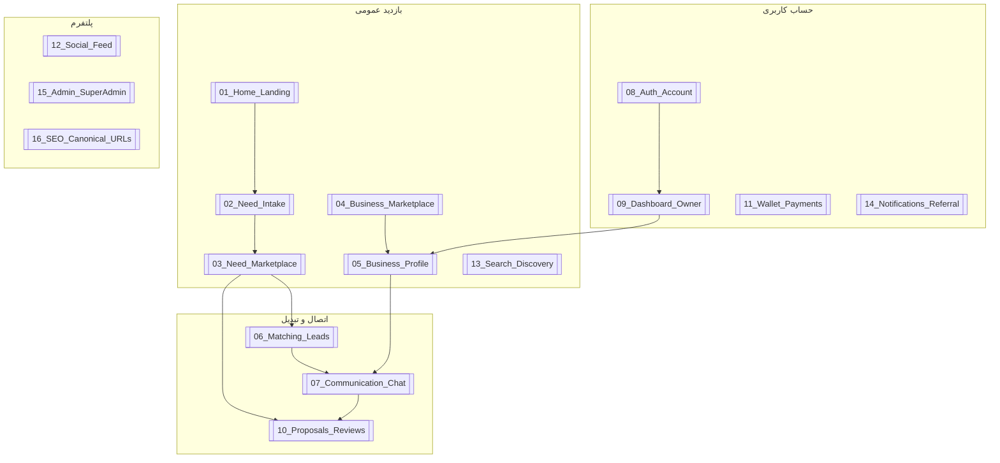

# نقشه محصول نیاز فایندر

> **نقطه ورود Vault** — ساختار سایت، نه فهرست فایل‌ها. برای کد → [[../90_Technical_Appendix/README|Technical Appendix]].

## نقشه کلی

## همه بخش‌های محصول

| # | بخش | یک خط |
|---|------|--------|
| 01 | [[../10_Product_Areas/01_Home_Landing\|خانه و لندینگ]] | ورود AI-first؛ نیاز را بگو → ثبت |
| 02 | [[../10_Product_Areas/02_Need_Intake\|ثبت نیاز]] | جریان هوشمند `/post` |
| 03 | [[../10_Product_Areas/03_Need_Marketplace\|بازار نیازها]] | مرور `/n/{شهر}` |
| 04 | [[../10_Product_Areas/04_Business_Marketplace\|بازار کسب‌وکار]] | مرور `/b/{شهر}` |
| 05 | [[../10_Product_Areas/05_Business_Profile\|پروفایل کسب‌وکار]] | صفحه عمومی `/b/{slug}` |
| 06 | [[../10_Product_Areas/06_Matching_Leads\|تطبیق و لید]] | رساندن نیاز به کسب‌وکار مناسب |
| 07 | [[../10_Product_Areas/07_Communication_Chat\|چت و تماس]] | گفتگو درون‌سایتی |
| 08 | [[../10_Product_Areas/08_Auth_Account\|ورود و حساب]] | OTP، نقش‌ها |
| 09 | [[../10_Product_Areas/09_Dashboard_Owner\|داشبورد]] | مدیریت نیازها و کسب‌وکار |
| 10 | [[../10_Product_Areas/10_Proposals_Reviews\|پیشنهاد و نظر]] | قیمت‌دهی و امتیاز |
| 11 | [[../10_Product_Areas/11_Wallet_Payments\|کیف پول]] | تراکنش و موجودی |
| 12 | [[../10_Product_Areas/12_Social_Feed\|فید اجتماعی]] | پست و تعامل |
| 13 | [[../10_Product_Areas/13_Search_Discovery\|جستجو]] | کشف و فیلتر یکپارچه |
| 14 | [[../10_Product_Areas/14_Notifications_Referral\|اعلان و دعوت]] | اطلاع‌رسانی و ریفرال |
| 15 | [[../10_Product_Areas/15_Admin_SuperAdmin\|ادمین]] | moderation و RBAC |
| 16 | [[../10_Product_Areas/16_SEO_Canonical_URLs\|SEO و URL]] | مسیرهای canonical |

## ابزارهای فکر کردن

| ابزار | Note |
|--------|------|
| شخصیت‌ها | [[Personas]] |
| سفر کاربر | [[UserJourneys]] |
| ایده‌های خام | [[IdeaInbox]] |
| نقشه راه | [[Roadmap]] |
| ارتباط فیچرها | [[../20_Cross_Links/FeatureRelationshipMap\|FeatureRelationshipMap]] |
| Graph راهنما | [[../00_Index/GraphGuide\|GraphGuide]] |

## لایه فنی

[[../90_Technical_Appendix/README|Technical Appendix]] — فقط وقتی می‌خواهی کد بزنی.
