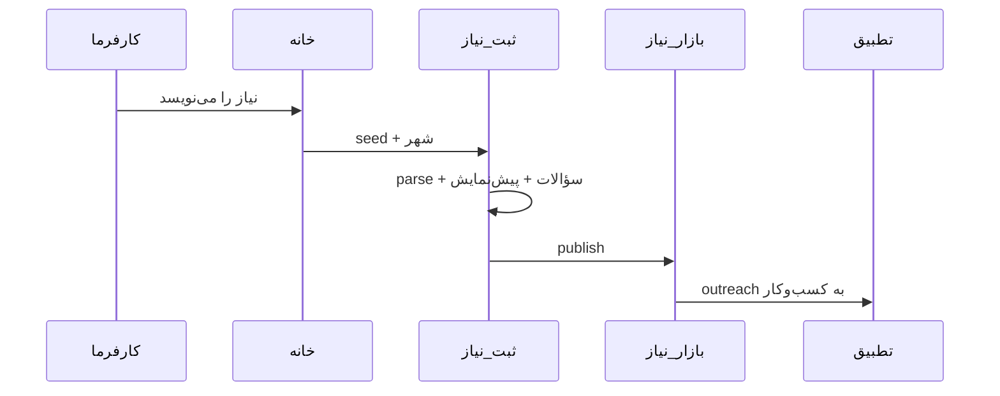

# سفرهای کاربری اصلی

## J1 — ثبت نیاز از خانه (هسته محصول)

| مرحله | بخش |
|--------|------|
| 1 | [[../10_Product_Areas/01_Home_Landing\|01 Home]] |
| 2 | [[../10_Product_Areas/02_Need_Intake\|02 Intake]] |
| 3 | [[../10_Product_Areas/03_Need_Marketplace\|03 Marketplace]] |
| 4 | [[../10_Product_Areas/06_Matching_Leads\|06 Leads]] |

## J2 — کسب‌وکار پاسخ می‌دهد

1. دریافت لید / دیدن نیاز در `/n/...`
2. [[../10_Product_Areas/10_Proposals_Reviews|پیشنهاد قیمت]]
3. [[../10_Product_Areas/07_Communication_Chat|چت]]
4. نظر پس از انجام

## J3 — ساخت پروفایل کسب‌وکار

1. [[../10_Product_Areas/08_Auth_Account|ورود]] به عنوان SPECIALIST
2. [[../10_Product_Areas/09_Dashboard_Owner|داشبورد]] → ویرایش
3. [[../10_Product_Areas/05_Business_Profile|پروفایل عمومی]]

## J4 — کشف از مرور

- [[../10_Product_Areas/13_Search_Discovery|جستجو]] یا `/n/iran` / `/b/iran`
- فیلتر شهر و دسته و محله

## J5 — Moderation

- Publish → صف → [[../10_Product_Areas/15_Admin_SuperAdmin|ادمین]] approve/reject

## Related

- [[Personas]]
- [[ProductMap]]
