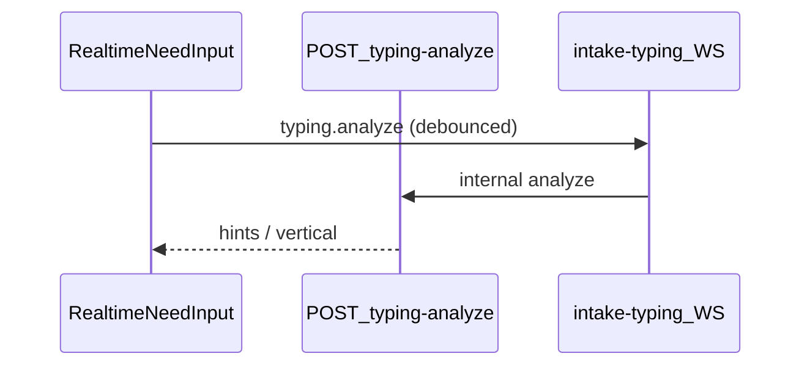

# Realtime Typing Analysis

تحلیل لحظه‌ای متن هنگام تایپ در `/post` — rules-only، بدون LLM روی keystroke.

## Docs

- [docs/TYPING_ANALYSIS.md](../../docs/TYPING_ANALYSIS.md) · [open](file:///Users/sasan/Desktop/NiazFinder%20main/docs/TYPING_ANALYSIS.md)

## Flow



## Frontend

| File | Role |
|------|------|
| [typing-socket-config.ts](../../src/lib/typing-socket-config.ts) | WS URL (`NEXT_PUBLIC_TYPING_WS_URL`) |
| [analyze.ts](../../src/lib/typing-analysis/analyze.ts) | Rule analysis |
| [merge-typing-seed.ts](../../src/lib/typing-analysis/merge-typing-seed.ts) | Merge into parsed intent |
| [RealtimeNeedInput](../../src/components/need-intake/realtime/) | UI component |

## API

- [typing-analyze/route.ts](../../src/app/api/need-intake/typing-analyze/route.ts)
- Secret: `TYPING_INTERNAL_SECRET`

## Nest

- Gateway namespace `/intake-typing`
- [[../02_Technical_Refs/NestBackendModules|NestBackendModules]] → `intake-typing`

## Env

See [[../00_Index/EnvMap|EnvMap]] — `NEXT_PUBLIC_TYPING_WS_URL`, `NEST_API_URL`

## Tests

```bash
npm run test:typing-analysis
```

## Related

- [[NeedIntake]]
- [[../02_Technical_Refs/SocketServices|SocketServices]]
