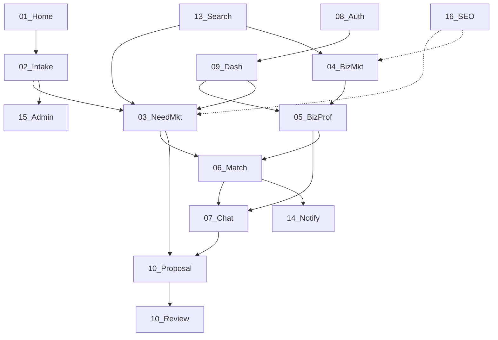

# نقشه ارتباط بین بخش‌های محصول

## دیاگرام کامل

## جدول ارتباطات

| از | به | نوع | توضیح |
|----|-----|-----|--------|
| [[../10_Product_Areas/01_Home_Landing\|01 Home]] | [[../10_Product_Areas/02_Need_Intake\|02 Intake]] | triggers | submit نیاز → `/post` |
| [[../10_Product_Areas/02_Need_Intake\|02 Intake]] | [[../10_Product_Areas/03_Need_Marketplace\|03 Need]] | creates | publish → آگهی در بازار |
| [[../10_Product_Areas/02_Need_Intake\|02 Intake]] | [[../10_Product_Areas/15_Admin_SuperAdmin\|15 Admin]] | requires | moderation قبل از نمایش |
| [[../10_Product_Areas/03_Need_Marketplace\|03 Need]] | [[../10_Product_Areas/06_Matching_Leads\|06 Leads]] | feeds | کسب‌وکار نیاز را می‌بیند |
| [[../10_Product_Areas/06_Matching_Leads\|06 Leads]] | [[../10_Product_Areas/07_Communication_Chat\|07 Chat]] | opens | intro message + need card |
| [[../10_Product_Areas/04_Business_Marketplace\|04 Biz Mkt]] | [[../10_Product_Areas/05_Business_Profile\|05 Profile]] | navigates | کلیک روی کارت |
| [[../10_Product_Areas/05_Business_Profile\|05 Profile]] | [[../10_Product_Areas/07_Communication_Chat\|07 Chat]] | converts | CTA چت |
| [[../10_Product_Areas/08_Auth_Account\|08 Auth]] | [[../10_Product_Areas/09_Dashboard_Owner\|09 Dashboard]] | gates | ورود برای داشبورد |
| [[../10_Product_Areas/07_Communication_Chat\|07 Chat]] | [[../10_Product_Areas/10_Proposals_Reviews\|10 Proposal]] | optional | پیشنهاد از گفتگو (ایده) |
| [[../10_Product_Areas/13_Search_Discovery\|13 Search]] | [[../10_Product_Areas/03_Need_Marketplace\|03]] [[../10_Product_Areas/04_Business_Marketplace\|04]] | discovers | ورود به لیست‌ها |
| [[../10_Product_Areas/16_SEO_Canonical_URLs\|16 SEO]] | همه بازارها | enables | URL پایدار و اشتراک |

## خوشه‌های محصول

| خوشه | اعضا | هدف کسب‌وکار |
|------|------|----------------|
| **Acquisition** | 01, 02, 13 | ورود و ثبت نیاز |
| **Marketplace** | 03, 04, 05, 16 | کشف و اعتماد |
| **Conversion** | 06, 07, 10 | تبدیل به معامله |
| **Account** | 08, 09, 11, 14 | نگهداشت کاربر |
| **Platform** | 12, 15 | شبکه و کنترل کیفیت |

## Related

- [[../00_Product_MOC/ProductMap|ProductMap]]
- [[../00_Product_MOC/IdeaInbox|IdeaInbox]]
