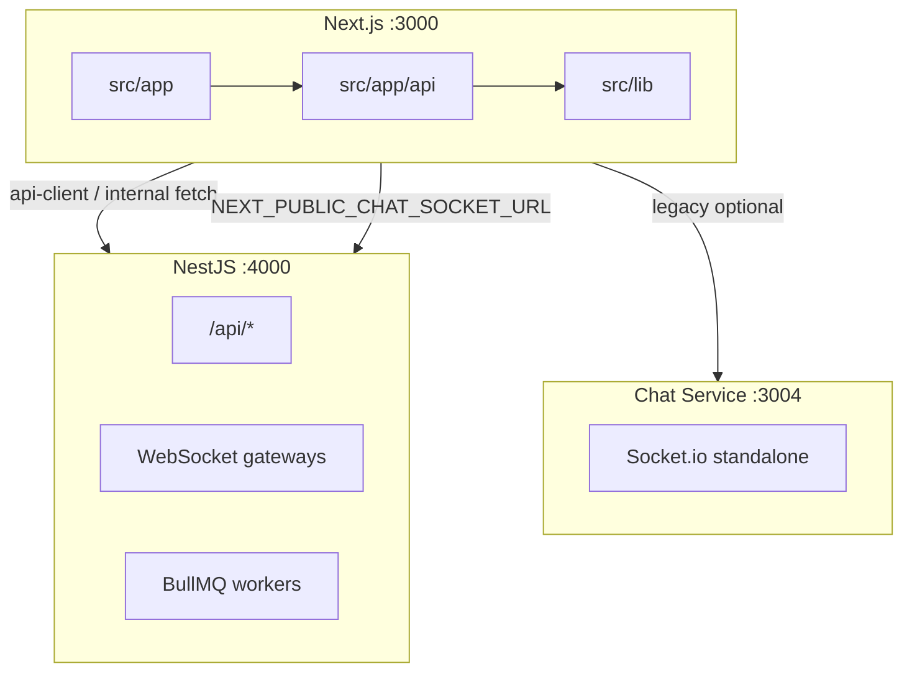

# Architecture

## Vault note (خلاصه)

سه لایهٔ اجرایی:

| سرویس | پورت پیش‌فرض | Entry |
|--------|---------------|--------|
| Next.js | 3000 | [layout.tsx](../../src/app/layout.tsx) · [open](file:///Users/sasan/Desktop/NiazFinder%20main/src/app/layout.tsx) |
| Nest backend | 4000 | [main.ts](../../mini-services/backend/src/main.ts) · [open](file:///Users/sasan/Desktop/NiazFinder%20main/mini-services/backend/src/main.ts) |
| Chat service | 3004 | [index.ts](../../mini-services/chat-service/index.ts) · [open](file:///Users/sasan/Desktop/NiazFinder%20main/mini-services/chat-service/index.ts) |

## مستند کامل (منبع حقیقت)

- [docs/ARCHITECTURE_INDEX.md](../../docs/ARCHITECTURE_INDEX.md) · [open](file:///Users/sasan/Desktop/NiazFinder%20main/docs/ARCHITECTURE_INDEX.md)

## فایل‌های کلیدی

| موضوع | مسیر |
|--------|------|
| Middleware (canonical URLs) | [src/middleware.ts](../../src/middleware.ts) |
| Next config + redirects | [next.config.ts](../../next.config.ts) |
| Docker stack | [docker-compose.yml](../../docker-compose.yml) |
| Caddy | [Caddyfile](../../Caddyfile) |
| Nest modules | [app.module.ts](../../mini-services/backend/src/app.module.ts) |

## Related

- [[EnvMap]]
- [[LocalRunbook]]
- [[APIRoutesCatalogue]]
- [[../02_Technical_Refs/SocketServices|SocketServices]]
