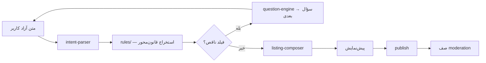

# Need Intake Engine (`src/intake/`)

## هدف
موتور اصلی تحلیل نیاز — متن آزاد فارسی کاربر در `/post` را به فیلدهای ساختاریافته (دسته، شهر/منطقه، بودجه، نوع معامله، urgency، ...) تبدیل می‌کند. **rules-first با LLM اختیاری** — نه یک سیستم صرفاً LLM-محور.

⚠️ این سیستم را با `src/lib/ai-agent/` (دستیار چت پلتفرم) اشتباه نگیرید — کاملاً مجزا هستند. جزئیات: [[../AI/intake-hybrid-rules-llm|Architecture/AI/intake-hybrid-rules-llm]].

## مسئولیت
- Parse متن آزاد فارسی → intent/slots
- سؤال بعدی هوشمند برای پرکردن فیلدهای ناقص
- پیش‌نمایش و ترکیب آگهی نهایی قبل از publish
- ارزیابی کیفیت (quality gate) قبل از انتشار

## زیرسیستم‌های کلیدی (۳۱ زیرپوشه)
| زیرپوشه | نقش | حجم |
|---------|-----|-----|
| `rules/` | بستهٔ قوانین استخراج به‌تفکیک دسته + generatorها | ۱۴۶ فایل — بزرگ‌ترین زیرسیستم |
| `intelligence-engine/` | لایهٔ هوشمند hybrid rules+LLM (truth reconciliation، تست‌های طلایی ابهام‌زدایی) | ۶۸ فایل |
| `fixtures/` | مجموعهٔ عظیم self-test (`run-*-self-test.ts`) | ۲۲ فایل |
| `smart-extractor/` | استخراج entity/slot | ۱۹ فایل |
| `agent/` | جریان intake مبتنی بر agent | ۱۱ فایل |
| `training/` | ساخت دیتاست آموزشی / flywheel | ۱۱ فایل |
| `projections/` | تصویرهای مشتق‌شده از داده | ۱۰ فایل |
| `template/` | تعریف بخش‌ها/قالب‌های intake | ۱۴ فایل |
| `migration/` | مهاجرت legacy → canonical | ۷ فایل |
| بقیه (کوچک‌تر) | `normalizer`, `tokenizer`, `matchers`, `scoring`, `extractors`, `validation`, `wizard`, `evolution`, `legacy`, `telemetry`, `rendering`, `dictionaries`, `state`, `entities`, `schema`, `ngrams`, `aggregate`, `api`, `assessment` | ۱-۵ فایل هرکدام |

## جریان کلی

## وابستگی‌ها
- **بالادست (این ماژول از آن‌ها می‌خواند)**: `src/lib/need-intake/local-chat-client.ts`, `local-model-config.ts` (برای مدل محلی LLM اختیاری) — این دو فایل را با احتیاط ویرایش کنید چون `src/lib/ai-agent/` هم به آن‌ها می‌خواند (فقط خواندن، نه وابستگی معکوس).
- **پایین‌دست (سرویس‌های خارجی)**: `mini-services/gemma4-intake` (LLM محلی)، `mini-services/backend` ماژول‌های `intake-typing`/`intake-queue`/`intake-intelligence` (تنها بخش‌های زندهٔ NestJS legacy).

## فایل‌های کلیدی (لینک، نه کد)
- `src/intake/index.ts` — نقطهٔ ورود
- `src/lib/need-intake/internal-orchestrator.ts`
- `src/lib/need-intake/intent-parser.ts`
- `src/lib/need-intake/question-engine.ts`
- `src/lib/need-intake/listing-composer.ts`
- `src/contracts/need-intake.ts`

## API مرتبط
`POST /api/need-intake/{parse-intent, next-question, extract-slots, chat-turn, preview-listing, publish, typing-analyze}` — جزئیات: [[../../10_Product_Areas/02_Need_Intake|10_Product_Areas/02_Need_Intake]]

## تست
حجم تست این ماژول به‌تنهایی بزرگ‌ترین خوشهٔ تست پروژه است — نگاه کنید به [[../../Testing/README|Testing/]].

## ⚠️ نکتهٔ ریسک شناخته‌شده
`src/components/need-intake.backup.20260711/` یک پوشهٔ بکاپ تاریخ‌دار (۴۰ فایل) کنار `src/components/need-intake/` فعلی در ریشهٔ سورس وجود دارد — منشأ و وضعیت فعالش (آیا هنوز لازم است؟) در این جلسه تأیید نشد؛ به [[../Frontend/component-structure|Architecture/Frontend/component-structure]] مراجعه کنید.

## منابع کامل (docs/)
- [docs/NEED_INTAKE.md](../../../docs/NEED_INTAKE.md)
- [docs/TYPING_ANALYSIS.md](../../../docs/TYPING_ANALYSIS.md)
