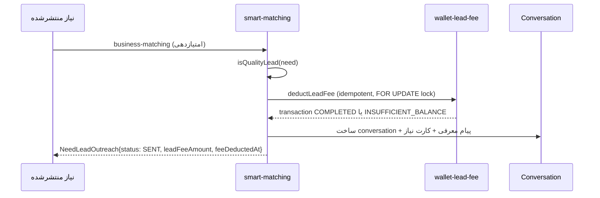

# Smart Matching (`src/lib/smart-matching/`)

## هدف
تطبیق نیاز منتشرشده با کسب‌وکارهای مرتبط و ارسال «لید» (VIP/AI-matched) به آن‌ها — با کسر خودکار فی از کیف پول کسب‌وکار در همان تراکنش.

## مسئولیت
- امتیازدهی تطابق نیاز↔کسب‌وکار (`matchScore`)
- تعیین سطح فی لید (عادی/باکیفیت) و کسر idempotent از کیف پول
- ساخت مکالمه + پیام معرفی + کارت نیاز در چت
- بازگشت فی در صورت انصراف/عدم برد (`refundLeadFee`)

## فایل‌های کلیدی
| فایل | نقش |
|------|-----|
| `src/lib/smart-matching/send-vip-lead.ts` | نقطهٔ ورود اصلی — `sendVipLeadToBusiness()`، شامل تشخیص «لید باکیفیت» (`isQualityLead`) |
| `src/lib/smart-matching/wallet-lead-fee.ts` | `deductLeadFee`/`refundLeadFee`/`getLeadFeeForUser` — الگوی مرجع idempotent lock-check برای کل پروژه |
| `src/lib/smart-matching/env.ts` | `getStandardLeadFeeToman()` (۱۰هزار)، `getQualityLeadFeeToman()` (۲۰هزار) |
| `src/lib/smart-matching/business-matching.ts` | منطق امتیازدهی/فیلتر کسب‌وکار واجد شرایط |
| `src/lib/smart-matching/need-resolution.ts` | بازگشت فی هنگام حل‌شدن نیاز بدون برد این کسب‌وکار |
| `src/lib/need-leads/send-lead-to-business.ts`, `qualified-lead.ts` | منطق دیسپچ لید مرتبط |

## معیار «لید باکیفیت» (از ۲۰۲۶-۰۷-۱۶)
شماره تماس مالک نیاز تاییدشده (`phoneVerified`) + بودجه مشخص + منطقه/شهر مشخص + `urgency` مشخص در `dynamicAnswers`. هر ۴ شرط لازم است.

## جریان

## دادهٔ مرتبط
مدل `NeedLeadOutreach` (بخش SERVICE REQUESTS در schema) — فیلدهای کلیدی: `leadFeeAmount`, `feeDeductedAt`, `walletTransactionId`, `accessPhase`, `idempotencyKey`.

## دو سطح UI مرتبط (نه دو مسیر پولی جدا)
`SmartLeadsSection` (لیدهای `status: SENT`) و `PrivateLeadsPanel` (لیدهای VIP با تایمر انقضا) هر دو از همین جدول می‌خوانند — فقط دو ویو متفاوت، نه دو سیستم پولی جدا. جزئیات: [[../../10_Product_Areas/06_Matching_Leads|10_Product_Areas/06_Matching_Leads]].

## روابط
- کسر فی از: [[wallet-payments|Architecture/Backend/wallet-payments]]
- تصمیم معماری: [[../../ADR/011-wallet-monetization-strategy|ADR/011-wallet-monetization-strategy]]

## منابع کامل (docs/)
- [docs/AI_LEAD_OUTREACH.md](../../../docs/AI_LEAD_OUTREACH.md)
- [docs/NEED_MATCH.md](../../../docs/NEED_MATCH.md)
