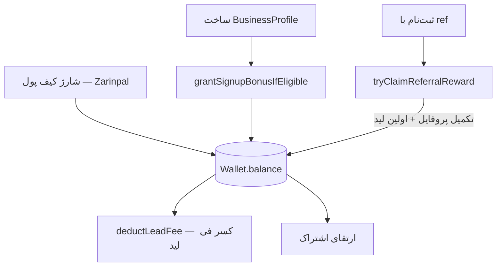

# Wallet & Payments (`src/lib/payment/`, `src/lib/wallet/`, `src/lib/referral/`)

## هدف
هستهٔ سیستم درآمدی نیازفایندر — کیف پول، درگاه پرداخت، قیمت‌گذاری لید، اشتراک، اعتبار هدیه، و رفرال. اکثر این سند محصول کار ۲۰۲۶-۰۷-۱۶ است.

## زیرسیستم‌ها

### ۱) کیف پول اصلی (پیش از این جلسه، production-grade)
- مدل: `Wallet` (`balance`, `frozen`) + `Transaction` (`type`, `amount`, `status`, `referenceId`) در schema — بخش WALLET & PAYMENTS
- API: `src/app/api/wallet/route.ts` — `GET` (موجودی+تاریخچه)، `POST` (`deposit` فقط ادمین مستقیم، `withdraw` با `FOR UPDATE` lock + `Serializable` isolation)
- الگوی مرجع idempotent: `src/lib/smart-matching/wallet-lead-fee.ts` (`deductLeadFee`/`refundLeadFee`) — قفل ردیف `SELECT ... FOR UPDATE`، چک idempotency هم قبل هم بعد از قفل (defends در برابر race هنگام انتظار برای قفل)

### ۲) درگاه پرداخت — Zarinpal (جدید، ۲۰۲۶-۰۷-۱۶)
- `src/lib/payment/zarinpal-client.ts` — `zarinpalRequestPayment`/`zarinpalVerifyPayment`، REST v4، sandbox پشتیبانی‌شده
- `src/lib/payment/env.ts` — `getZarinpalMerchantId`, `isZarinpalSandbox`, `getWalletMinDepositToman`, `getWalletMaxDepositToman`
- `POST /api/wallet/deposit/initiate` — می‌سازد `Transaction{type: DEPOSIT, status: PENDING, referenceId: authority}`
- `GET /api/wallet/deposit/callback` — verify می‌کند، تراکنش را idempotent به `COMPLETED` می‌برد و موجودی را افزایش می‌دهد

### ۳) قیمت‌گذاری دو سطحی لید
به [[smart-matching|Architecture/Backend/smart-matching]] مراجعه کنید — `getStandardLeadFeeToman()` (۱۰هزار)، `getQualityLeadFeeToman()` (۲۰هزار).

### ۴) اشتراک (Free/Pro/Business)
- مدل: `Subscription{plan: SubscriptionPlan, expiresAt, autoRenew}` — رابطهٔ ۱:۱ با `User`
- `src/lib/smart-matching/wallet-lead-fee.ts` → `getLeadFeeForUser()` تخفیف پلن (`PRO_LEAD_DISCOUNT_PERCENT`=۲۰٪، `BUSINESS_LEAD_DISCOUNT_PERCENT`=۳۰٪) را روی فی لید اعمال می‌کند
- API: `src/app/api/subscription/route.ts` — بدون تمدید خودکار پیچیده (طبق قانون کاربر «Dynamic Pricing پیچیده استفاده نشود»)، ارتقا = کسر یک‌بارهٔ مبلغ ثابت ماهانه از کیف پول

### ۵) اعتبار هدیهٔ ثبت‌نام
- `src/lib/payment/signup-bonus.ts` → `grantSignupBonusIfEligible()` — فقط هنگام اولین ساخت `BusinessProfile` (نه هر CLIENT)، idempotent با چک `Transaction{type: BONUS, description}`
- Hook در `src/lib/business/ensure-profile.ts` (بعد از `businessProfile.create` موفق)

### ۶) رفرال (چرخهٔ کامل Capture → Condition → Reward)
- Capture: `src/components/referral/ReferralCapture.tsx` (`?ref=` را در `localStorage` ذخیره می‌کند) + `src/app/api/auth/register-phone/route.ts` (فیلد `referralCode` روی `User`، تولید در ثبت‌نام)
- Reward: `src/lib/payment/referral-reward.ts` → `tryClaimReferralReward()` — شرط: تکمیل پروفایل **و** مشاهدهٔ اولین لید؛ پاداش دوطرفه (`REFERRAL_REWARD_TOMAN`=۵۰هزار)
- Hook در: `src/app/api/users/profile/route.ts` (بعد از آپدیت پروفایل)، `src/app/api/business/leads/route.ts` (بعد از اولین fetch لید)

## جریان کلی پرداخت لید

## روابط
- قوانین کسب‌وکاری بالادست: [[../../Business Logic/README|Business Logic/]]
- تصمیم معماری: [[../../ADR/011-wallet-monetization-strategy|ADR/011-wallet-monetization-strategy]]
- بک‌لاگ (تبلیغات، گزارش بازار): [[../../10_Product_Areas/17_Monetization_Backlog|10_Product_Areas/17_Monetization_Backlog]]

## ⚠️ نکتهٔ عملیاتی مهم (از تجربهٔ این جلسه)
هنگام اعمال تغییرات schema روی این ماژول، `prisma db push` را با احتیاط اجرا کنید — اگر migration history با دیتابیس drift داشته باشد، `db push` می‌تواند drift های نامرتبط قدیمی را هم بی‌صدا اعمال و داده واقعی را drop کند. جزئیات: [[../../Debug/README|Debug/]].
