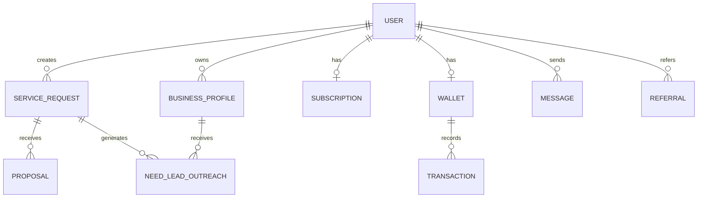

# Database Schema Overview (`prisma/schema.prisma`)

## هدف
نقشهٔ دامنه‌ای ۶۳ مدل / ۲۵ enum — بر اساس ۱۷ بخش کامنت‌شده در خود فایل schema (نه بازخوانی هر مدل به‌تنهایی).

## ER در سطح دامنه

## ۱۷ بخش دامنه‌ای (به ترتیب فایل)
۱. USERS & AUTH ۲. STAFF RBAC (Super Admin) ۳. INTAKE LOCATION CATALOG ۴. AGENT RAG LOCATION HIERARCHY (pgvector) ۵. INTAKE AGENT RAG (pgvector) ۶. CATEGORIES & SKILLS ۷. SERVICE REQUESTS ۸. PROPOSALS ۹. PORTFOLIO ۱۰. UNIVERSAL BUSINESS PROFILE ۱۱. MESSAGES & CHAT ۱۲. REVIEWS & RATINGS ۱۳. WALLET & PAYMENTS ۱۴. NOTIFICATIONS ۱۵. ADMIN & SYSTEM ۱۶. COUPONS & REFERRALS ۱۷. FIRST-PARTY ANALYTICS.

> بخش‌های ۱۳ و ۱۶ در ۲۰۲۶-۰۷-۱۶ گسترش یافتند: `User.referralCode`, `Subscription`, `SubscriptionPlan` اضافه شدند.

## روابط
- کاتالوگ خام مدل‌ها: `90_Technical_Appendix/Technical_Refs/PrismaSchemas.md`
- استراتژی ORM: [[../../ADR/007-prisma-orm-strategy|ADR/007-prisma-orm-strategy]]

## ⚠️ نکتهٔ عملیاتی
تاریخچهٔ `prisma/migrations/` می‌تواند از دیتابیس dev واگرا شود (drift) — قبل از `prisma migrate dev` یا `db push`، `prisma migrate status` را چک کنید. جزئیات و یک حادثهٔ واقعی: [[../../Debug/README|Debug/]].
