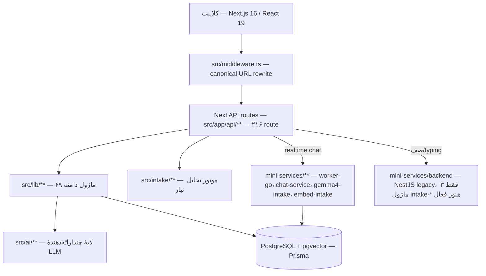

# معماری سیستم

## هدف
نقشهٔ معماری فنی نیازفایندر در سطح ماژول — برای هر دامنهٔ بزرگ کد، یک سند جداگانه که مسئولیت، وابستگی‌ها، و فایل‌های کلیدی را (با لینک به مسیر، نه کپی کد) توضیح می‌دهد.

## نمای کلی سیستم

## اسناد این پوشه

| زیرپوشه | موضوع |
|---------|-------|
| [[Backend/README\|Backend/]] | `src/lib/`, `src/intake/`, API routes |
| [[Frontend/README\|Frontend/]] | `src/components/`, `src/app/` |
| [[Database/README\|Database/]] | `prisma/schema.prisma` — ۱۷ بخش دامنه‌ای |
| [[AI/README\|AI/]] | `src/ai/`, `src/lib/ai-agent/`, `src/lib/rag/`, هستهٔ hybrid intake |
| [[Infrastructure/README\|Infrastructure/]] | `mini-services/`, Docker profiles، live/dead |

## روابط
- منبع حقیقت تفصیلی هر ماژول: `docs/*.md` (لینک از هر سند، نه کپی).
- لایهٔ محصول (چرا این فیچر وجود دارد): [[../00_Product_MOC/ProductMap|00_Product_MOC/ProductMap]].
- کاتالوگ‌های خام فایل/کامپوننت/API که از قبل وجود دارند و اینجا بازنویسی نمی‌شوند: `90_Technical_Appendix/Technical_Refs/`.

## ترتیب خواندن
۱) این فایل → ۲) `Database/schema-overview.md` (مدل داده پایه) → ۳) دامنهٔ مورد نظرتان در `Backend/` یا `AI/` → ۴) `Infrastructure/mini-services.md` اگر روی سرویس‌های جانبی کار می‌کنید.

## فرضیه‌ها
دیاگرام بالا بر اساس مشاهدهٔ کد در تاریخ ۲۰۲۶-۰۷-۱۶ است، نه سند معماری رسمی قبلی (چون چنین سندی در ریشهٔ ریپو وجود نداشت).
