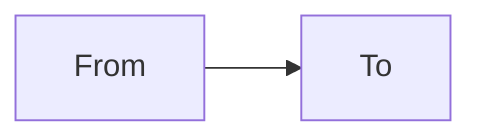

# ارتباط: <% tp.file.title %>

## از → به

| From | To | نوع ارتباط | توضیح |
|------|-----|-----------|--------|
| [[../10_Product_Areas/|]] | [[../10_Product_Areas/|]] | triggers / feeds / requires | |

## نمودار

