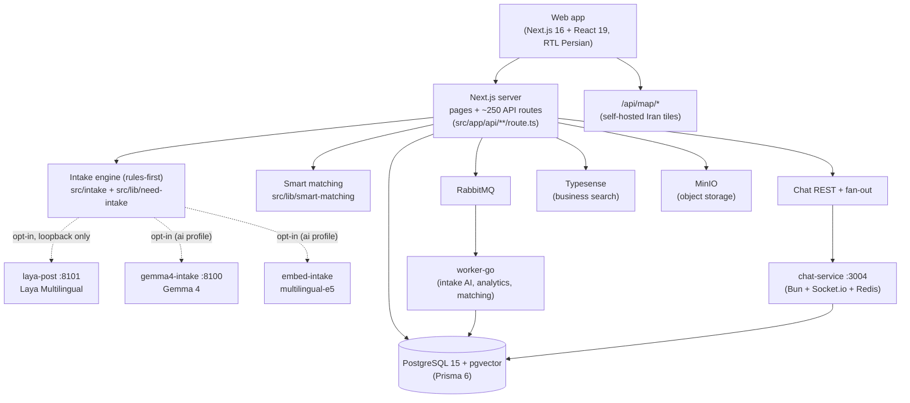

# NiazFinder

[](https://github.com/sasanappstore2/NiazFinder-main/actions/workflows/ci.yml)
[](LICENSE)

NiazFinder (نیازفایندر) is a **needs-first marketplace**: instead of starting by browsing existing listings, users describe what they actually need in free text, the platform structures that need, and then matches it to relevant businesses.

> **Status:** active open-source project under development. APIs, schemas, and UI copy (Persian, RTL) are still evolving. See [Roadmap](#roadmap).

## Why NiazFinder?

Traditional marketplaces organize discovery around existing listings: sellers post, buyers search. That works when buyers already know the catalog vocabulary, but it breaks down for services, custom work, and anything described in everyday language ("I need an apartment near a metro station in Mashhad, around 80m, mortgage plus rent…").

NiazFinder explores the reverse direction:

1. The user states a **need** in natural language (primarily Persian).
2. A rules-first **intake engine** parses it into a structured representation (category, location, budget, attributes, timing).
3. That structure drives **search, browse, and matching**, so businesses see qualified demand instead of keyword noise.

The technical thesis is that a well-validated, deterministic parsing layer — with optional, strictly-gated local AI assistance — produces better marketplace matching than search-over-listings alone.

## How It Works

```text
User describes a need (/post)
  → requirement extraction (rules-first Persian intake engine)
  → structured representation (category · location · budget · attributes)
  → search / matching (browse, smart matching, VIP leads)
  → relevant marketplace results (businesses respond via chat + proposals)
```

What actually exists today:

- **Need intake (`/post`)** — wizard + composer UI backed by `src/intake/` (tokenizer, normalizer, extractors, matchers, scoring, validation, telemetry) and `src/lib/need-intake/`. Runs **rules-only by default** (`NEED_INTAKE_LLM_ENABLED=false`).
- **Optional AI assistance (opt-in, local)** — a private Laya Multilingual worker (`mini-services/laya-post`, model `convaiinnovations/laya-multilingual`) reachable only on loopback via `/api/post/natural-analyze`; a Gemma 4 sidecar (`mini-services/gemma4-intake`, `ai` compose profile); an embedding sidecar (`mini-services/embed-intake`, multilingual-e5). All AI paths are disabled unless explicitly enabled, and Laya auto-apply is off by default behind a confidence threshold (`LAYA_POST_AUTO_APPLY=false`, `LAYA_POST_MIN_CONFIDENCE`).
- **Marketplace browse** — location-scoped need/business/service browsing (`/n/…`, `/b/…`, `/s/…`) with canonical-URL middleware and locally served Iran map tiles (`/api/map/*`).
- **Smart matching & leads** — `src/lib/smart-matching/` (VIP lead broadcast, trust scoring, need visibility, chat-session caps).
- **Chat** — realtime messaging via `mini-services/chat-service` (Bun + Socket.io, Redis fan-out); a Go-based chat service (`mini-services/chat-go`) is in development as a higher-concurrency replacement.
- **Proposals, reviews, wallet** — business proposals on needs, reviews, and a wallet with Zarinpal top-up, lead pricing tiers, and one-time subscription deductions (no auto-renew billing yet).

Anything not listed here should be treated as planned or experimental — check [Roadmap](#roadmap).

## Architecture



Notes:

- The **frontend and backend both live in the Next.js app**; the backend is the set of `src/app/api/**/route.ts` handlers. `mini-services/backend` (NestJS) is **legacy** (docker `legacy` profile) and not part of the active path.
- The intake engine is the core of the project: `src/intake/` holds extractors, normalizer, tokenizer, matchers, scoring, validation, wizard state, schema-evolution, training-dataset builders, and telemetry. `docs/` and `OBISIDIAN/` contain extensive design notes for it.

## Technology

Only technologies actually present in this repository:

| Area | Technology |
|---|---|
| App | Next.js 16 (App Router), React 19, TypeScript, Bun |
| UI | Tailwind CSS v4, shadcn/ui (Radix), Zustand, TanStack Query, React Hook Form + Zod, MapLibre / Mapbox GL, next-intl |
| Database | PostgreSQL 15 + pgvector, Prisma 6 (81 models, 35 enums) |
| Infra (docker compose) | postgres, redis, minio, typesense, rabbitmq, worker-go (Go), chat-service |
| AI sidecars (opt-in) | laya-post (Laya Multilingual, FastAPI), gemma4-intake (GGUF via llama.cpp, `ai` profile), embed-intake (multilingual-e5, `ai` profile); optional Gemini fallback / LM Studio gateway |
| Auth | Phone OTP (Iran numbers), NextAuth sessions, token table |
| Mobile | Capacitor iOS shell (`mobile/`, in progress) |

## Project Structure

```text
src/
  app/
    (main|admin|auth|chat)/   # pages by route group
    api/**/route.ts           # backend — all API endpoints live here
  intake/                     # core need-parsing engine (rules-first)
  lib/                        # ~100 domain modules (need-intake, smart-matching,
                              #   business, chat, search, geo, map, wallet, rbac, …)
  components/ hooks/ stores/  # UI layer (RTL Persian)
  middleware.ts               # canonical / legacy marketplace URL handling
prisma/schema.prisma          # database schema
mini-services/
  laya-post/                  # private Laya Multilingual worker (/post intake)
  gemma4-intake/              # local Gemma 4 sidecar (ai profile)
  embed-intake/               # local embedding sidecar (ai profile)
  worker-go/                  # Go queue consumer (intake AI, analytics, matching)
  chat-service/               # realtime chat (Bun + Socket.io)
  chat-go/                    # Go chat replacement (in development)
  estate-scrape/              # business site-import scrapers
  backend/                    # legacy NestJS service (legacy profile)
mobile/                       # Capacitor iOS shell (in progress)
scripts/                      # tsx self-tests, smoke tests, seed/geo/crawl tooling
docs/ OBISIDIAN/              # design docs; OBISIDIAN/00_Product_MOC/ProductMap.md is the product overview
```

`examples/`, `**/fixtures/**`, and `mini-services/` are excluded from the root `tsconfig.json`. Import alias: `@/*` → `src/*`.

## Development

Prerequisites: Node 20+, Bun, Docker, and a copy of `.env.example` as `.env.local`.

```bash
# 1. Infrastructure (postgres, redis, minio, typesense, rabbitmq, worker-go, chat)
docker compose up -d
# With local AI sidecars (Gemma 4 + embeddings):
docker compose --profile ai up -d

# 2. Database
npm run db:push            # or: npm run db:migrate
npm run db:seed:locations

# 3. App on :3000 (runs `prisma generate && next dev`)
npm run dev

# Realtime chat (separate process):
npm run dev:chat

# Private Laya worker for /post natural-language intake (optional, loopback only):
npm run dev:laya-post
```

Useful references: `docs/ENV_MAP.md` (environment map), `docs/DEV_TROUBLESHOOTING.md`, `docs/CHAT_DEV_RUNBOOK.md`, `AGENTS.md` (repo conventions).

## Environment Variables

Copy `.env.example` → `.env.local`. All secrets stay in local env files, never in git. Key groups:

| Group | Variables | Notes |
|---|---|---|
| Intake (rules-first default) | `NEED_INTAKE_RULES_ONLY`, `NEED_INTAKE_LLM_ENABLED=false`, `AI_SEMANTIC_RESOLVER_ENABLED` | AI off unless explicitly enabled |
| Laya `/post` worker | `LAYA_POST_URL`, `LAYA_MODEL_NAME`, `LAYA_POST_MIN_CONFIDENCE`, `LAYA_POST_AUTO_APPLY=false` | Loopback-only; auto-apply off by default |
| Local LLM gateway | `NEED_INTAKE_LLM_URL`, `NEED_INTAKE_LLM_MODEL`, `LOCAL_LLM_ONLY`, `GEMINI_API_KEY` (optional fallback) | LM Studio OpenAI-compatible `:1234` |
| Queues | `RABBITMQ_URL`, `RABBITMQ_USER/PASSWORD`, `INTAKE_QUEUE_SYNC_FALLBACK` | Async intake AI + analytics |
| Search | `TYPESENSE_*` | Business search |
| Security | `INTERNAL_API_SECRET`, `JWT_SECRET`, `CHAT_INTERNAL_SECRET` | **Required in production** |
| Chat realtime | `NEXT_PUBLIC_CHAT_SOCKET_URL`, `REDIS_URL`, `CHAT_CORS_ORIGINS` | Prod should lock down CORS origins |
| Payments (Zarinpal) | `ZARINPAL_MERCHANT_ID`, `ZARINPAL_SANDBOX`, `WALLET_*` | Wallet top-up |
| Maps | `NEXT_PUBLIC_MAPBOX_ACCESS_TOKEN`, `NEXT_PUBLIC_MAP_SURFACE` | Tiles served locally via `/api/map/*` |

## Testing

There is no jest/vitest suite. Testing is `tsx`-based self-tests plus smoke/stress scripts (see `package.json` scripts):

```bash
npx tsc --noEmit          # typecheck (clean)
npm run lint              # eslint src (0 errors; some RTL-spacing warnings)
npm run test:intake-baseline   # intake engine rules-only gate (also runs in CI)
npm run test:intake-engine
npm run test:post-pipeline
npm run smoke:routes
npm run check:all         # full local gate: validate + typecheck + lint + build + self-tests
```

CI (`.github/workflows/`): `intake-baseline.yml` (rules-only intake gate on `src/**` changes) and `site-health-gate.yml` (offline gate on PRs, smoke gate on schedule). See also `CONTRIBUTING.md`.

API contract: [`docs/API.md`](docs/API.md) + [`docs/openapi.json`](docs/openapi.json) (regenerate: `npm run docs:openapi`).

## Security

Concise summary — details and reporting policy in [SECURITY.md](SECURITY.md):

- **Authentication** — phone-OTP login for Iran numbers plus password/NextAuth sessions; tokens stored server-side (`AuthToken`) with expiry. A fixed test OTP (`1234`) exists but is hard-gated to non-production (`NODE_ENV` check) — never enable `ALLOW_TEST_OTP` in production.
- **Authorization** — role-based (`CLIENT`, `SPECIALIST`, `ADMIN`, `SUPER_ADMIN`) plus staff roles; admin/super-admin routes require elevated roles.
- **Internal/worker routes** (`/api/internal/*`, chat fan-out) require `INTERNAL_API_SECRET` compared in constant time and **fail closed** (`503` when unconfigured, `403` on mismatch).
- **User-provided data** — intake and publish paths validate with Zod schemas; the Laya worker allow-lists question IDs/types and caps state size, batch size, and request bytes.
- **Secrets** — env-only (`.env.local`, never committed); `.env.example` documents placeholders. Historical `.env` files were once tracked — those values must be treated as exposed (see SECURITY.md).
- **Database access** — Prisma exclusively; pgvector extension for similarity search.
- **AI input/output** — AI sidecars are loopback-only, never browser-reachable directly; adapters are research-gated (explicit manifest + checksum verification, experiment-only, never production-loaded).

No security properties beyond what is implemented and reviewed here are claimed. Please report vulnerabilities privately per SECURITY.md.

## Roadmap

Honest snapshot based on the current tree — **Current** (working), **In progress** (present but incomplete), **Planned** (signs in repo, not built).

**Current**

- Rules-first Persian need intake (`/post`) with publish/validation parity tests
- Location-scoped marketplace browse with canonical URLs and local map tiles
- Smart matching / VIP leads, chat + proposals + reviews, wallet + Zarinpal top-up
- Docker stack (postgres, redis, minio, typesense, rabbitmq, worker-go, chat)

**In progress**

- Laya Multilingual `/post` worker (implemented, confidence-gated, auto-apply off; needs calibration on a human-labeled holdout before auto-apply)
- Go chat service (`chat-go`) as higher-concurrency replacement for the Bun chat service
- Capacitor iOS shell (`mobile/`)
- Estate/business site-import scrapers; OSM/Divar neighborhood coverage tooling

**Planned**

- Subscription auto-renew billing (today: one-time wallet deductions only)
- Broader multilingual intake beyond Persian/English where the rules engine and Laya coverage genuinely support it
- Production hardening: secret rotation runbook, rate-limit tuning, backup/restore docs

## Contributing

See [CONTRIBUTING.md](CONTRIBUTING.md). Short version: fork, branch, run `npx tsc --noEmit && npm run lint` plus the relevant `test:*` self-test, and open a PR using the template. Please follow the [Code of Conduct](CODE_OF_CONDUCT.md) and report security issues privately per [SECURITY.md](SECURITY.md).

Areas where automation helps most (and where maintainer tooling / AI-assisted review is welcome): intake regression coverage, Persian-locale edge cases, API contract tests, dependency hygiene, and security review of new endpoints.

## License

MIT — see [LICENSE](LICENSE).
