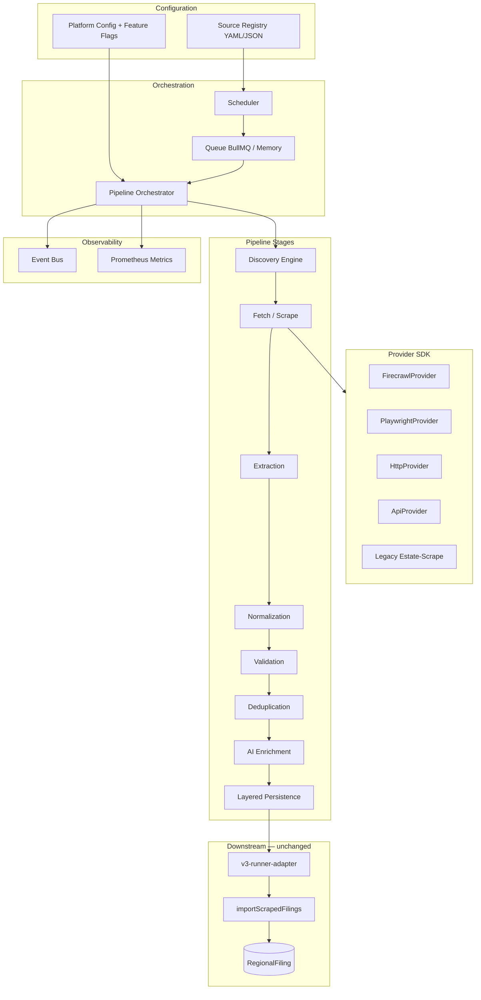

# Crawler Platform V3 — Architecture

## Overview

NiazFinder Crawler Platform V3 is a **provider-agnostic**, event-driven crawling subsystem.
Firecrawl is the default first-class provider; Playwright, HTTP, API, and legacy estate-scrape
are peers behind identical contracts.

**Business services never import provider SDKs directly.**

## Layer diagram



## Folder structure

```
crawler/v3/
├── api/                 # CrawlerPlatformService — public API
├── bridge/              # v3-runner-adapter → ScrapedFilingRow
├── config/              # schema, defaults, sources.example.json
├── domain/              # Property, CrawlSource, DomainEvent
├── sdk/                 # CrawlProviderContract, capabilities, BaseProviderAdapter
├── providers/
│   ├── registry.ts
│   ├── api/
│   ├── legacy/          # estate-scrape HTTP bridge
│   └── (firecrawl/http/playwright reuse crawler/providers/*)
├── registry/            # SourceRegistry
├── scheduler/           # CrawlScheduler
├── queue/
│   ├── queue-factory.ts
│   └── bullmq/          # BullMQ + Redis job store
├── pipeline/            # CrawlPipelineOrchestrator
├── events/              # InMemoryEventBus
├── storage/             # LayeredCrawlStorage (immutable artifacts)
├── ai/                  # EnrichmentPipeline
├── monitoring/          # PrometheusMetricsExporter
├── fixtures/            # Self-tests
└── docs/                # (see crawler/docs/v3/)
```

## Design rules

| Rule | Enforcement |
|------|-------------|
| Provider independence | `CrawlProviderContract` only in business code |
| No provider logic in pipeline | Providers fetch; parsers normalize |
| Immutable raw artifacts | `LayeredCrawlStorage.appendRaw` never overwrites |
| AI enriches only | `EnrichmentPipeline` has no fetch methods |
| Idempotent jobs | `(scraperId, externalId)` at DB boundary unchanged |
| Replaceable layers | DI via `OrchestratorDeps` |

## Provider selection matrix

| Source type | Provider | Discovery | Extraction |
|-------------|----------|-----------|------------|
| Public marketing sites | `firecrawl` | map-api | firecrawl-extract |
| AJAX portals | `api` or `estate-scrape-legacy` | pagination | dom |
| Auth portals | `playwright` / `estate-scrape-legacy` | post-login nav | dom + scrapegraph |
| High-volume batch | `firecrawl` crawl | recursive | schema |

## Queue evolution

| Phase | Driver | Persistence |
|-------|--------|-------------|
| Dev | `memory` | In-process |
| Staging | `bullmq` + Redis | Redis job metadata |
| Prod | BullMQ workers | S3 raw + Postgres meta (planned) |

Set `CRAWLER_QUEUE_DRIVER=bullmq` and `CRAWLER_REDIS_URL=redis://...`.

## Events

Domain events drive downstream workflows (analytics, alerts, re-index):

- `CrawlStarted`, `CrawlCompleted`, `CrawlFailed`
- `PageDiscovered`, `PageFetched`
- `ExtractionCompleted`, `ValidationFailed`
- `EntityCreated`, `EntityUpdated`, `DuplicateDetected`
- `ProviderFailed`

## Activation

```bash
export CRAWLER_V3_ENABLED=true
export FIRECRAWL_API_KEY=fc-...
# optional distributed queue:
export CRAWLER_QUEUE_DRIVER=bullmq
export CRAWLER_REDIS_URL=redis://127.0.0.1:6379
```

Filing tick path: `runner.ts` → `scrapeFilingFeedV3` → `importScrapedFilings` (unchanged).
