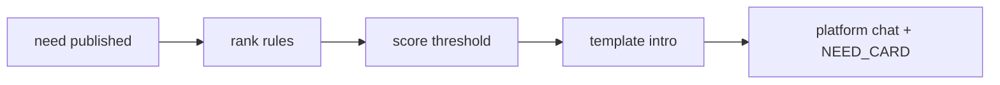

# AI lead outreach — template-based (no LLM)

## Overview

After a need is published, eligible businesses receive a proactive chat lead from the platform account. Qualification and copy are **rules-only**:

1. [`matchBusinessesForNeed`](../src/lib/need-match/rank-businesses.ts) — deterministic candidate ranking
2. [`qualifyBusinessesForOutreach`](../src/lib/need-leads/qualify-outreach.ts) — filter by `LEAD_MIN_MATCH_SCORE`
3. [`outreach-copy-templates.ts`](../src/lib/need-leads/outreach-copy-templates.ts) — fixed Persian intro message
4. [`send-lead-to-business.ts`](../src/lib/need-leads/send-lead-to-business.ts) — chat NEED_CARD + notification

## Env

| Variable | Default | Purpose |
|----------|---------|---------|
| `LEAD_OUTREACH_ENABLED` | `true` | Master switch |
| `LEAD_MIN_MATCH_SCORE` | `0.65` | Minimum match score to qualify |
| `LEAD_OUTREACH_DAILY_CAP_PER_BUSINESS` | `3` | Max leads per business per day |
| `LEAD_OUTREACH_MAX_PER_REQUEST` | `8` | Max businesses contacted per need |

## Flow

## Business opt-out

Businesses can disable alerts via `leadAlertsEnabled` on their profile.
