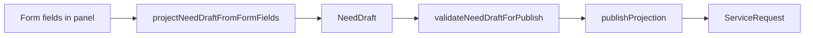

# NeedDraft — قرارداد داده intake

> نوع type: [`src/contracts/need-intake.ts`](../src/contracts/need-intake.ts)  
> لایه aggregate: [`src/intake/aggregate/needDraftAggregate.ts`](../src/intake/aggregate/needDraftAggregate.ts)  
> نسخه‌بندی: [`intake-schema-versions.md`](./intake-schema-versions.md)

`NeedDraft` **منبع حقیقت واحد** بین wizard و publish است. UI نباید مستقیم `parsedIntent` یا `answers` بنویسد.

**نسخه فعلی:** `NEED_DRAFT_SCHEMA_VERSION = 1` (v1.0)

---

## فیلدهای canonical (خواندنی / نوشتنی)

| فیلد | نوع | منبع محاسبه | publish |
|------|-----|------------|---------|
| `needType` | `string` | `resolveNeedType(entities)` | ✅ required |
| `schemaVersion` | `number` | `ensureNeedDraftContract` + `needTypes` | ✅ |
| `vertical` | `string` | entities / needType | ✅ |
| `category` | `string` | entities | ✅ |
| `entities` | `Record<string, unknown>` | `patchNeedDraftEntities` | ✅ |
| `sourceText` | `string` | `syncIntakeSourceTextFromForm` | ✅ required |
| `completionScore` | `number` | `needSchema` — UX only | ❌ gate |
| `completionState` | enum | از score — UX only | ❌ gate |
| `matchabilityScore` | `number` | scoring engine | ❌ |
| `sections` | `NeedDraftSection[]` | از needType def | UI |
| `missingFields` | `MissingFieldItem[]` | `buildPrioritizedMissingFields` | UX hint |
| `nextQuestion` | `WizardQuestion?` | wizard builder | legacy UX |
| `listingPreview` | `ListingPreview?` | preview step | ✅ title/desc |
| `leadPhone` | `string?` | lead draft / URL | optional |
| `intakeTrace` | trace object | analyze API | training |
| `intelligenceProfile` | optional | rules/listing enrichment | future |
| `updatedAt` | ISO string | recompute | ✅ |

---

## entities کلیدی (نمونه‌های پرکاربرد)

| کلید | نقش | validator field |
|------|------|-----------------|
| `categorySlug` | slug دسته | `category` |
| `subcategorySlug` | زیردسته | — |
| `city` / `citySlug` | شهر | `city` |
| `neighborhood` / `neighborhoodSlug` | محله | `neighborhood` |
| `transactionType` | BUY/RENT/… | `transactionType` |
| `budgetMin` / `budgetMax` | بودجه | `budget` |
| `area` | متراژ | `area` |
| `rooms` | اتاق | `rooms` |
| `lat` / `lng` | پین نقشه | `mapPin` (املاک) |

Presence logic: [`entityRegistry.ts`](../src/intake/entities/entityRegistry.ts)

---

## فیلدهای deprecated (فقط خواندنی)

| فیلد | جایگزین |
|------|---------|
| `parsedIntent` | merge به `entities` via `draftToLegacyPayload` |
| `answers` | قدیمی — همه به entities منتقل شوند |
| `turns` | conversational chat — منسوخ |

**گارد (فاز ۴):** `warnLegacyWriteDetected` در dev روی write مستقیم **خطا می‌دهد**.

---

## APIهای store مجاز

```ts
// ✅ مسیرهای صحیح
patchNeedDraft(draft => patchNeedDraftEntities(draft, patch))
setNeedDraft(draft)
projectNeedDraftFromFormFields(form)
syncNeedDraftFromFormFields(form)

// ❌ deprecated — throw در dev (حذف فاز ۱۲)
setAnswer()
setParsedIntent()
```

---

## جریان داده



---

## needType و requiredFields

تعریف در [`needTypes.ts`](../src/intake/schema/needTypes.ts). نمونه:

| needType | required | mapPin |
|----------|----------|--------|
| `apartment-rent-seeking` | transactionType, neighborhood | ✅ املاک |
| `plumbing-service-seeking` | neighborhood, description | ❌ |
| `car-seeking` | city | ❌ |
| `general-seeking` | category, city | ❌ |

**تناقض UX:** `needSchema.ts` (completionScore) ممکن است با `publishValidator` diverge کند — یکپارچه‌سازی در **فاز ۱۶** (`getPublishReadiness`).

**تست قرارداد:** `npm run test:draft-roundtrip`
