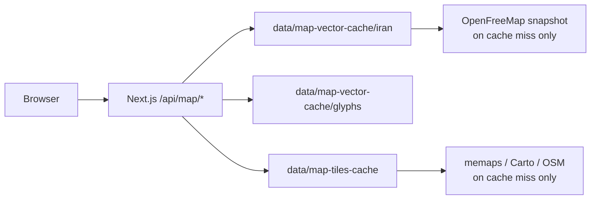

# Iran local map setup

NiazFinder serves a **self-hosted Divar-style Iran map** with no external tile requests in normal operation. Tiles are cached on disk under `data/` (not in git).

## Architecture



| Surface | API | Default |
|---------|-----|---------|
| Vector (primary) | `/api/map/vector/iran/{z}/{x}/{y}.pbf` | Yes |
| Glyphs | `/api/map/glyphs/{fontstack}/{range}.pbf` | Yes |
| Raster (fallback) | `/api/map/tiles/{z}/{x}/{y}?theme=` | On vector error |

Style: `buildIranDivarStyle()` in `src/lib/map/iran/divar-style.ts` ? Divar-inspired palette, Persian labels via local glyphs.

## First run after clone

```bash
npm run map:verify-cache      # check disk cache
npm run map:prewarm-iran        # if verify fails (~1 GB bootstrap)
npm run dev
npm run smoke:map               # after Next is up on :3000
```

Full national coverage (optional, ~13+ GB):

```bash
npm run map:prewarm-iran:full
```

## Backup before risky operations

Before `rm -rf .next`, disk cleanup, or moving machines:

```bash
npm run map:backup-cache
```

Produces `map-cache-YYYYMMDD-HHMMSS.tar.gz` in the repo root. Extract with:

```bash
tar -xzf map-cache-*.tar.gz
```

## Environment variables

| Variable | Default | Purpose |
|----------|---------|---------|
| `NEXT_PUBLIC_MAP_SURFACE` | `vector` | Force `raster` to use memaps tiles only |
| `MAP_VECTOR_CACHE_ENABLED` | `true` | Disable with `false` ? no disk resilience |
| `MAP_TILE_CACHE_ENABLED` | `true` | Raster cache toggle |
| `MAP_TILE_UPSTREAM_*` | memaps chain | Override raster upstream URLs |

See `.env.example` for full list.

## Cache layout

```
data/map-vector-cache/
  iran/{z}/{x}/{y}.pbf     # vector tiles (z5?14)
  glyphs/{font}/{range}.pbf
data/map-tiles-cache/
  {light|dark}/{z}/{x}/{y}.png
```

Typical bootstrap size: ~400 MB vector + ~20 MB raster after `map:prewarm-iran`.

## Troubleshooting

### Gray empty map box

1. Check dev server: `curl -s -o /dev/null -w '%{http_code}' http://localhost:3000/api/map/vector/iran/5/20/12`
2. Run `npm run map:verify-cache`
3. Hard refresh browser (`Cmd+Shift+R`)
4. Check console for `resolveIranGlyphsUrl` or style errors

### Map worked yesterday, blank today

- Dev server not running ? start `npm run dev`
- `.next` cache stale ? restart dev (avoid deleting `data/`)
- `iran-void-mask` regression ? run `npm run test:map-tiles` (guards against void mask)

### Persian labels missing

- Glyph cache empty ? `npm run map:prewarm-iran`
- Verify: `curl http://localhost:3000/api/map/glyphs/Noto%20Sans%20Regular/0-255.pbf`

### Raster fallback active

Console shows `[map] vector failed, switching to raster`. Vector upstream or cache issue ? run `map:verify-cache` and `map:prewarm-iran`.

## Tests

```bash
npm run map:verify-cache   # disk only
npm run test:map-tiles     # config + cache + live raster fetch
npm run smoke:map          # live Next.js map APIs
```

## Browse URLs

- Needs: http://localhost:3000/b/iran?type=need&view=map
- Businesses: http://localhost:3000/b/iran?type=business&view=map
- Pin picker: http://localhost:3000/post
