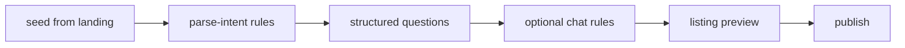

# Need intake — smart step-by-step posting (internal engine)

## Flow



1. **Parse** — Rule-based vertical classifier + intent parser (<100ms). Typing strip gives instant hints while user types.
2. **Structured questions** — One question per step from schema (property, vehicle, product, services, jobs, etc.).
3. **Chat** — After core fields, free-form messages re-parsed with rules (no external LLM).
4. **Preview** — Template-composed title + description; manual edit + optional extras.
5. **Publish** — Creates `ServiceRequest`; lead outreach uses score threshold + template copy.

## Internal engine

| Module | Role |
|--------|------|
| [`internal-orchestrator.ts`](../src/lib/need-intake/internal-orchestrator.ts) | parse, typing merge, next step, readiness |
| [`extract-slots-rules.ts`](../src/lib/need-intake/extract-slots-rules.ts) | Map entities + chip answers to schema slots |
| [`listing-composer.ts`](../src/lib/need-intake/listing-composer.ts) | Persian title/description templates per vertical |
| [`chat-turn-rules.ts`](../src/lib/need-intake/chat-turn-rules.ts) | Chat re-parse + slot merge |
| [`typing-analysis/`](../src/lib/typing-analysis/) | Real-time hints while typing (rules only) |

## APIs

| Route | Purpose |
|-------|---------|
| `POST /api/need-intake/parse-intent` | Initial parse (rules) |
| `POST /api/need-intake/next-question` | Next schema field |
| `POST /api/need-intake/extract-slots` | Slot hints after each answer |
| `POST /api/need-intake/chat-turn` | Chat message → slots + readiness |
| `POST /api/need-intake/preview-listing` | Build title/description |
| `POST /api/need-intake/publish` | Create `ServiceRequest` |
| `POST /api/need-intake/typing-analyze` | Debounced typing hints |

## Env

| Variable | Default | Notes |
|----------|---------|-------|
| `NEED_INTAKE_SKIP_PROCESSING_DELAY` | unset | Set `true` in dev to skip 250ms UX delay |
| `NEED_INTAKE_PARSE_CACHE_TTL_MS` | 900000 | Parse cache TTL |

## UI

- [`NeedIntakePanel`](../src/components/need-intake/NeedIntakePanel.tsx) — main flow
- [`IntakeStepTimeline`](../src/components/need-intake/IntakeStepTimeline.tsx) — تشخیص → جزئیات → پیش‌نمایش → ثبت
- [`IntakeProcessingLoader`](../src/components/need-intake/IntakeProcessingLoader.tsx) — short processing animation
- [`NeedListingPreview`](../src/components/need-intake/NeedListingPreview.tsx) — edit + «بازنویسی خودکار»

## Tests

```bash
npm run test:intake-parser    # rule parser fixtures
npm run test:intake-flow      # end-to-end orchestrator per vertical
npm run test:typing-analysis  # typing strip rules
```

## QA checklist

- [ ] Long seed → final title ≠ verbatim seed
- [ ] After 2+ required answers → chat phase opens
- [ ] Chat improves readiness; «ساخت پیش‌نمایش آگهی» works
- [ ] Lead phone from `/` → not asked in chat
- [ ] Budget in seed/chat → shown in preview
- [ ] Manual edit + extras → saved on publish
- [ ] «بازنویسی خودکار» refreshes copy
- [ ] `خونه میخوام در محدوده ولنجک تهران` → property + ولنجک
- [ ] `تعمیرکار کولر فوری غرب تهران` → services/repairs
- [ ] Parser + flow self-tests pass offline
