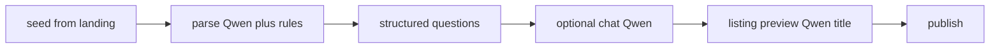

# Need intake — smart step-by-step posting (internal engine)

## Flow



1. **Parse** — Qwen3.5-2B via `intake-mlx` merged with rules (`reconcileParsedIntent`). Typing strip gives instant hints while user types (rules only).
2. **Structured questions** — One question per step from schema (property, vehicle, product, services, jobs, etc.).
3. **Chat** — After core fields, free-form messages re-parsed with Qwen + rules hybrid.
4. **Preview** — AI-generated title (max 70 chars, Qwen → vertical rules → snippet fallback) + template description; manual edit + optional extras. Generic titles like `خرید — مشهد` are rejected at publish.
5. **Publish** — Creates `ServiceRequest`; lead outreach uses score threshold + template copy.

## Internal engine

| Module | Role |
|--------|------|
| [`internal-orchestrator.ts`](../src/lib/need-intake/internal-orchestrator.ts) | parse, typing merge, next step, readiness |
| [`extract-slots-rules.ts`](../src/lib/need-intake/extract-slots-rules.ts) | Map entities + chip answers to schema slots |
| [`listing-composer.ts`](../src/lib/need-intake/listing-composer.ts) | Persian description templates + title fallback |
| [`vertical-title.ts`](../src/lib/need-intake/vertical-title.ts) | Vertical title builders (vehicles, services, jobs, property, products) |
| [`generate-listing-title.ts`](../src/lib/need-intake/generate-listing-title.ts) | AI title (Qwen → heuristic → template) |
| [`listing-title-sanitize.ts`](../src/lib/need-intake/listing-title-sanitize.ts) | Max length, reject generic `deal — city` only |
| [`qwen-intake-client.ts`](../src/lib/need-intake/qwen-intake-client.ts) | Unified MLX client (parse + title) |
| [`analysis-from-qwen.ts`](../src/lib/need-intake/analysis-from-qwen.ts) | Analyze route Qwen + rules merge |
| [`chat-turn-rules.ts`](../src/lib/need-intake/chat-turn-rules.ts) | Chat re-parse + slot merge |
| [`typing-analysis/`](../src/lib/typing-analysis/) | Real-time hints while typing (rules only) |

## APIs

| Route | Purpose |
|-------|---------|
| `POST /api/intake/analyze` | Canonical intake analyze (rules + optional Qwen) |
| ~~`POST /api/need-intake/parse-intent`~~ | **410 Gone** — use `/api/intake/analyze` |
| `POST /api/intake/analyze` | Full entity analysis (Qwen + rules when MLX enabled) |
| `POST /api/need-intake/next-question` | Next schema field |
| `POST /api/need-intake/extract-slots` | Slot hints after each answer |
| `POST /api/need-intake/chat-turn` | Chat message → slots + readiness |
| `POST /api/need-intake/preview-listing` | Build AI title + template description |
| `POST /api/need-intake/publish` | Create `ServiceRequest` |
| `POST /api/need-intake/typing-analyze` | Debounced typing hints |

## Env

| Variable | Default | Notes |
|----------|---------|-------|
| `NEED_INTAKE_LLM_ENABLED` | unset | Set `true` to use Qwen via MLX for parse/analyze/title |
| `NEED_INTAKE_LLM_URL` | `http://127.0.0.1:8100` | intake-mlx base URL |
| `NEED_INTAKE_LLM_TIMEOUT_MS` | 12000 | MLX request timeout |
| `NEED_INTAKE_SKIP_PROCESSING_DELAY` | unset | Set `true` in dev to skip 250ms UX delay |
| `NEED_INTAKE_PARSE_CACHE_TTL_MS` | 900000 | Parse cache TTL |
| `NEED_INTAKE_TITLE_AI_ENABLED` | auto | Set `false` to force template titles only |

## UI

- [`NeedIntakePanel`](../src/components/need-intake/NeedIntakePanel.tsx) — main flow
- [`IntakeStepTimeline`](../src/components/need-intake/IntakeStepTimeline.tsx) — تشخیص → جزئیات → پیش‌نمایش → ثبت
- [`IntakeProcessingLoader`](../src/components/need-intake/IntakeProcessingLoader.tsx) — short processing animation
- [`NeedListingPreview`](../src/components/need-intake/NeedListingPreview.tsx) — edit + «بازنویسی خودکار»

## Listing title rules

| Vertical | Builder | Example |
|----------|---------|---------|
| Real estate | `buildPropertyTitle` | خرید آپارتمان ۲ خواب — مشهد |
| Vehicles | `buildVehicleTitle` + text extract | خرید خودرو — کارواش — در حد نو — مشهد |
| Services | `buildServiceTitle` | نیاز — [خدمت] — [شهر] |
| Jobs | `buildJobTitle` | استخدام — [عنوان] — [شهر] |
| Products / electronics | `buildProductSearchTitle` | خرید — [موضوع از متن] — [شهر] |

Pipeline: [`generateListingTitle`](src/lib/need-intake/generate-listing-title.ts) tries MLX `/v1/title`, then [`buildHeuristicListingTitle`](src/lib/need-intake/vertical-title.ts). Titles that fail [`rejectListingTitleReason`](src/lib/need-intake/listing-title-sanitize.ts) cannot be published (HTTP 422).

## `/post` production gate

Headless gate for the 4-step `/post` flow (`NeedIntakePanel`). MLX is **required** for the full gate (analyze + listing-copy + stream).

### Env

| Variable | Required for gate | Notes |
|----------|-------------------|--------|
| `NEED_INTAKE_LLM_ENABLED` | `true` | MLX analyze + copy |
| `NEED_INTAKE_COPY_AI_ENABLED` | `true` | Stream preview uses MLX JSON copy |
| `NEED_INTAKE_LLM_URL` | default `http://127.0.0.1:8100` | Start with `npm run dev:intake-mlx` |

### Commands

```bash
npm run dev:intake-mlx              # MLX sidecar (required for mlx gate)
npm run dev                         # Next.js (required for API smoke)

npm run test:post-pipeline          # 150+ golden scenarios via post-pipeline-harness
npm run test:post-mlx-gate          # MLX analyze + /v1/listing-copy + stream (FAIL if MLX down)
npm run test:post-api-smoke         # HTTP smoke: /api/intake/analyze + preview-listing/stream
npm run test:post-production-gate:smoke   # ~3–5 min CI gate
npm run test:post-production-gate:full    # nightly: + 100k subset + estate-benchmark:llm
npm run test:post-gate-baseline     # write data/need-intake-training/post-gate-baseline.json
```

### Smoke gate order

1. `tsc --noEmit`
2. `test:post-pipeline` (150+ golden, ~1200 assertions)
3. `test:post-intake-scenarios` + `test:listing-title-scenarios`
4. `test:post-estate-scenarios` (60+ LRE cases)
5. `test:post-mlx-gate` (**required** — no skip)
6. `test:post-api-smoke`
7. `test:prefill-100k:smoke` (≥88%)

`check:all` includes `test:post-pipeline` (rules-only). Run `test:post-production-gate:smoke` before sign-off.

### Sign-off checklist (manual, ~5 min after gate green)

- [ ] مغازه + ۱B رهن + ۱۰۰M اجاره + سجاد مشهد → عنوان «رهن و اجاره مغازه…» نه «فروش»
- [ ] تغییر شهر/محله در مرحله location → re-analyze بدون overwrite دستی
- [ ] Stream preview در details/location → baseline سپس عنوان
- [ ] Publish با عنوان generic → 422
- [ ] `npm run test:post-production-gate:smoke` → 0 failure

## Tests

```bash
npm run test:intake-parser    # rule parser fixtures
npm run test:intake-flow      # end-to-end orchestrator per vertical
npm run test:listing-title    # title sanitizer + template fallback (offline)
npm run test:intake-dataset   # 58+ golden cases + accuracy report
npm run test:typing-analysis  # typing strip rules
npm run test:post-pipeline    # /post headless golden matrix
npm run export:intake-dataset # JSONL for Unsloth (data/need-intake-training/)
```

## هم‌ترازی املاک با دیوار

Taxonomy و فیلترهای intake املاک با browse دیوار هم‌خوان شده‌اند (شامل **اجاره کوتاه‌مدت**، قیمت هر متر، سن بنا، طبقه، امکانات گسترده‌تر). مرجع کامل: [DIVAR_REAL_ESTATE_MATRIX.md](./DIVAR_REAL_ESTATE_MATRIX.md).

```bash
npm run divar:research -- --city=tehran --limit=500
```

خروجی نمونه‌برداری: `data/divar/research/` (در gitignore).

## Dev lab (NODE_ENV=development)

On [`/post`](http://localhost:3000/post), collapse **آزمایشگاه ثبت نیاز** to run fixtures, export JSONL, and inspect parse JSON. See [NEED_INTAKE_ML.md](./NEED_INTAKE_ML.md).

## QA checklist

- [ ] `npm run test:post-production-gate:smoke` green (MLX + API smoke)
- [ ] Long seed → final title ≠ verbatim seed
- [ ] After 2+ required answers → chat phase opens
- [ ] Chat improves readiness; «ساخت پیش‌نمایش آگهی» works
- [ ] Lead phone from `/` → not asked in chat
- [ ] Budget in seed/chat → shown in preview
- [ ] Manual edit + extras → saved on publish
- [ ] «بازنویسی خودکار» refreshes copy
- [ ] `خونه میخوام در محدوده ولنجک تهران` → property + ولنجک
- [ ] `تعمیرکار کولر فوری غرب تهران` → services/repairs
- [ ] Low-confidence parse shows category badge + clarifying chips
- [ ] `npm run test:intake-dataset` ≥75% (target 90% before ML phase 2)
- [ ] Parser + flow + dataset self-tests pass offline
- [ ] Dev lab: eval fixtures + JSONL export on `/post` (development only)
