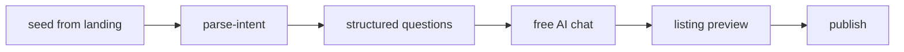

# Need intake — smart chat, polish, preview

## Flow

1. **Parse** — User text is raw input only; LLM must not copy the sentence as listing title.
2. **Structured questions** — Schema fields (e.g. service type, location, budget).
3. **Chat** — After core fields (≥2 required answered), free-form chat with AI.
4. **Preview** — Polished title + description; manual edit + optional extras.
5. **Publish** — Saves listing; skips second AI enrich if preview was confirmed.

## APIs

| Route | Purpose |
|-------|---------|
| `POST /api/need-intake/parse-intent` | Initial parse |
| `POST /api/need-intake/next-question` | Next schema field |
| `POST /api/need-intake/chat-turn` | Chat message → slots + readiness |
| `POST /api/need-intake/preview-listing` | Build polished title/description |
| `POST /api/need-intake/publish` | Create `ServiceRequest` |

## Lead phone

- From landing (`lead-draft` / `?phone=`) → `draft.leadPhone` and `answers._leadPhone`.
- Chat prompt: do not ask for phone again.

## Budget

- Extracted at parse and in chat `slotUpdates.budget`.
- Shown in preview when present.

## Title policy

- [`listing-quality.ts`](../src/lib/need-intake/listing-quality.ts) — `isTitleTooCloseToRaw`, `shouldPolishListing`.
- [`map-to-request.ts`](../src/lib/need-intake/map-to-request.ts) — no `rawText` as title fallback.
- [`enrichListingWithLlm`](../src/lib/need-intake/llm-parse-intent.ts) — polish at preview/publish.

## UI components

- [`NeedIntakePanel`](../src/components/need-intake/NeedIntakePanel.tsx)
- [`IntakeChatComposer`](../src/components/need-intake/IntakeChatComposer.tsx)
- [`NeedListingPreview`](../src/components/need-intake/NeedListingPreview.tsx)

## QA checklist

- [ ] Long seed → final title ≠ verbatim seed
- [ ] After 2+ required answers → chat phase opens
- [ ] Chat improves readiness; «ساخت پیش‌نمایش آگهی» works
- [ ] Lead phone from `/` → not asked in chat
- [ ] Budget in seed/chat → shown in preview
- [ ] Manual edit + extras → saved on publish
- [ ] «پالیش دوباره با AI» refreshes copy
