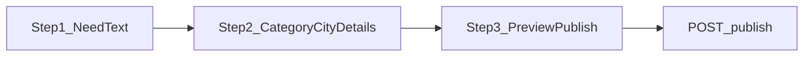

# Need intake — manual 3-step wizard (`/post`)

## Flow



1. **نیاز** — کاربر متن نیاز (و جزئیات اختیاری) را خودش می‌نویسد. هیچ فراخوانی `/api/intake/analyze` یا MLX وجود ندارد.
2. **دسته و مکان** — انتخاب دسته، شهر، محله و فیلدهای عمودی (بودجه، متراژ، …) از فرم.
3. **پیش‌نمایش** — عنوان و توضیح از **template** (`composeListingFromDraft` + `resolveDeterministicListingTitle`)؛ قابل ویرایش دستی قبل از انتشار.
4. **انتشار** — `POST /api/need-intake/publish` با `validateNeedDraftForPublish` (بدون gate ارزیابی AI).

## منبع حقیقت draft

| Module | Role |
|--------|------|
| [`needDraftAggregate.ts`](../src/intake/aggregate/needDraftAggregate.ts) | `syncNeedDraftFromForm`, `buildParsedIntentFromForm`, `recomputeNeedDraft` |
| [`listing-composer.ts`](../src/lib/need-intake/listing-composer.ts) | توضیح template |
| [`resolve-listing-title.ts`](../src/lib/need-intake/resolve-listing-title.ts) | عنوان deterministic |
| [`generate-listing-copy.ts`](../src/lib/need-intake/generate-listing-copy.ts) | سرور: فقط template (بدون Qwen) |
| [`publishValidator.ts`](../src/intake/validation/publishValidator.ts) | اعتبارسنجی انتشار |

`parsedIntent` از فیلدهای فرم ساخته می‌شود (`buildParsedIntentFromForm`)، نه از parse آزاد متن در زمان ناوبری.

## APIs (فعال)

| Route | Purpose |
|-------|---------|
| `POST /api/need-intake/preview-listing` | پیش‌نمایش template عنوان/توضیح |
| `POST /api/need-intake/publish` | ایجاد `ServiceRequest` |

## APIs حذف‌شده (AI)

- `POST /api/intake/analyze`
- `POST /api/intake/assess`, `assess-chat`, `ai-status`
- `POST /api/need-intake/preview-listing/stream`
- صف async intake (`/api/need-intake/queue`)

## UI

- [`NeedIntakePanel`](../src/components/need-intake/NeedIntakePanel.tsx) — ویزارد ۳مرحله‌ای یک‌پارچه (need → details/location → preview)
- [`IntakeStepTimeline`](../src/components/need-intake/IntakeStepTimeline.tsx) — نوار پیشرفت
- [`NeedListingPreview`](../src/components/need-intake/NeedListingPreview.tsx) — ویرایش عنوان/توضیح

## Env (محلی)

| Variable | Notes |
|----------|-------|
| `NEED_INTAKE_AUTO_APPROVE` | تایید خودکار در dev (اختیاری) |
| Postgres / Redis | browse و publish (بدون پورت 8100 MLX) |

متغیرهای `NEED_INTAKE_LLM_*`, `INTAKE_MLX_*` و `dev:intake-mlx` حذف شده‌اند.

## تست

```bash
npm run test:post-pipeline
npm run test:publish-validator
npm run test:post-intake-scenarios
```

## AI آینده

قرارداد `NeedDraft` و publish API بدون breaking change نگه داشته شده تا در صورت نیاز، AI پشت feature flag دوباره اضافه شود. فعلاً هیچ stub MLX در runtime فعال نیست.
