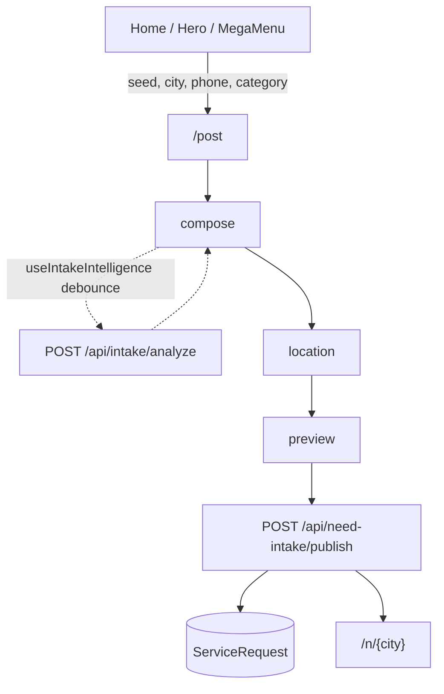

# `/post` Need Intake — Architecture Handoff

> **Audience:** Claude (architect) + Cursor (executor)  
> **Date:** 2026-07-11  
> **Status:** Survey from live code. Prefer this + code over stale docs where they conflict.  
> **Bridge:** [`PLAN/claude-cursor-bridge.md`](../PLAN/claude-cursor-bridge.md)

Canonical product path: **`/post`**. Users describe a need in Persian free text; the system parses it (rules-first, optional AI), collects structured fields by vertical template, previews listing copy, and publishes a `ServiceRequest` for matching/browse.

**Naming trap:** `/post/[id]` is **social feed**, not intake. Intake edit `/post/edit/[id]` currently redirects to dashboard (deferred).

---

## 1. User flow

### Entry

| Route | File | Role |
|-------|------|------|
| `/post` | `src/app/(main)/post/page.tsx` | Primary intake wizard |
| `/post?seed=&city=&category=&phone=` | same | Prefill from home / mega menu / lead |
| `/post?as=company&linkBusiness=1` | `NeedIntakePanel` | Link need to business profile |
| `/post/edit/[id]` | `src/app/(main)/post/edit/[id]/page.tsx` | Disabled → `/dashboard?tab=requests` |
| `/post/[id]` | `src/app/(main)/post/[id]/page.tsx` | Social post — **not** intake |

**Funnels:** `HomeLeadLanding`, `NeedHeroInput`, `CategoryMegaMenu`, business profile needs section.

### Wizard steps

Contract: `IntakeStep` in `src/contracts/need-intake.ts`  
UI steps: `compose` → `location` → `preview` (`src/lib/need-intake/intake-wizard-steps.ts`)



Publish requires auth; pending draft resumes via `pending-intake-publish.ts` after login.

---

## 2. Layers

```
UI          NeedIntakePanel + step components
Hooks       use-intake-draft / location / intelligence / analyze / publish / form-projection
Store       need-intake-store.ts  (NeedDraft canonical)
API         /api/intake/analyze  ·  /api/need-intake/publish  ·  preview / queue / status
Domain      src/intake/  (aggregate, intelligence-engine, templates, validation, projections)
Glue        src/lib/need-intake/  (clients, listing copy, queue, location sync)
DB          Prisma ServiceRequest (+ optional RabbitMQ / Redis queue)
```

---

## 3. Key code anchors

| Concern | Path |
|---------|------|
| Page shell | `src/app/(main)/post/page.tsx` |
| Orchestrator UI | `src/components/need-intake/NeedIntakePanel.tsx` (~1168 LOC) |
| Contracts | `src/contracts/need-intake.ts` |
| Store | `src/stores/need-intake-store.ts` |
| Aggregate | `src/intake/aggregate/needDraftAggregate.ts` |
| Intelligence | `src/intake/intelligence-engine/orchestrator.ts` |
| Publish gate | `src/intake/validation/publishValidator.ts` |
| Projections | `src/intake/projections/publishProjection.ts` |
| Analyze API | `src/app/api/intake/analyze/route.ts` |
| Publish API | `src/app/api/need-intake/publish/route.ts` |
| Client APIs | `src/lib/need-intake/intake-client.ts` |

### Analyze pipeline (rules-first)

1. Normalize → extract entities + rules packs  
2. Resolvers: location, category, budget, property, deal-type  
3. Confidence + gap detection  
4. Optional AI (`NEED_INTAKE_LLM_ENABLED` / hybrid flags)  
5. Build / merge `NeedDraft`

Default production mode: **rules-only** unless LLM flags are on.

### Publish pipeline

1. Auth + Zod  
2. `validateNeedDraftForPublish`  
3. Title sanitize → `toServiceRequestV2` / `mapDraftToCreateRequest`  
4. Auto-approve policy or pending review  
5. Sync or RabbitMQ async + status poll  
6. Optional cognitive shadow (observability only) + training capture

---

## 4. Strengths

1. Canonical `NeedDraft` + aggregate APIs with legacy deprecation guards  
2. Rules-first publish (never blocked on LLM)  
3. Template-driven verticals (`resolveTemplate` + `IntakeTemplateForm`)  
4. Strong self-test suite (`test:post-pipeline`, `test:publish-validator`, …)  
5. User lock semantics (category/city/neighborhood survive analyze merges)  
6. Auth resume + lead phone edge cases handled  

---

## 5. Complexity hotspots

1. **`NeedIntakePanel` monolith** — hooks extracted; panel still owns most JSX/effects  
2. **Dual state** — form fields + `needDraft` + deprecated `parsedIntent`/`answers`  
3. **Two analyze stacks** — intelligence-engine (primary) vs legacy `intakeEngine` / `intent-parser`  
4. **Doc drift** — `docs/NEED_INTAKE.md` / ADR-004 claim manual-only; live code uses `/api/intake/analyze`  
5. **Route naming** — `/post/[id]` social vs intake  
6. **Publish branching** — sync / queue / auto-approve / shadow in one route  
7. **Completion UX vs publish validator** can diverge  

---

## 6. Gaps / deferred

| Area | Status |
|------|--------|
| `/post/edit/[id]` | Redirect only |
| Conversational chat intake | Removed (ADR-005) |
| Panel refactor (`useNeedIntakePanel`) | Documented, not landed |
| `NEED_INTAKE.md` refresh | Out of sync |
| Listing copy AI stream | Disabled; template-only |
| Cognitive engine | Shadow-only on publish |

---

## 7. Doc map (trust order)

**Prefer:**
- `docs/adr/001-intake-ai-strategy.md`
- `docs/INTAKE_NEED_DRAFT.md`
- `docs/INTAKE_STORE.md`
- `docs/INTAKE_QUEUE_ARCHITECTURE.md`
- **this file** + live code

**Stale / contradict code:**
- `docs/NEED_INTAKE.md` (denies live analyze)
- `docs/adr/004-post-manual-wizard.md` (vs intelligence engine still present)
- Parts of `OBISIDIAN/01_Features/NeedIntake.md` (removed routes)

Hub: `docs/INTAKE_INDEX.md`

---

## 8. Suggested next work packages (for Claude to prioritize)

WP1. Refresh `docs/NEED_INTAKE.md` + Obsidian feature page to match this handoff  
WP2. Slim `NeedIntakePanel` into step views + `useNeedIntakePanel` (as onboarding docs describe)  
WP3. Unify client readiness UX with `validateNeedDraftForPublish`  
WP4. Re-enable or permanently remove listing-copy stream; document decision  
WP5. Implement or formally cancel `/post/edit/[id]`  

---

## 9. Verification commands

```bash
npm run test:post-pipeline
npm run test:post-intake-scenarios
npm run test:publish-validator
npm run test:need-intake-store
# Manual: http://localhost:3000/post
```

Key env: `NEED_INTAKE_LLM_ENABLED`, `NEED_INTAKE_RULES_ONLY`, `INTAKE_QUEUE_ENABLED`, `NEED_INTAKE_AUTO_APPROVE`
