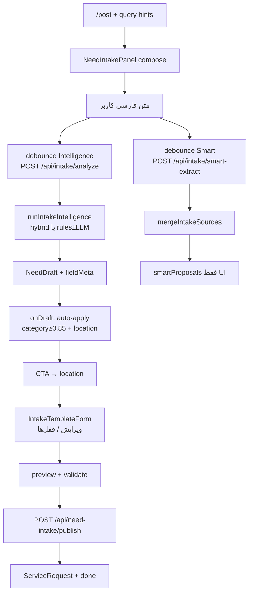

# گزارش کامل سیستم `/post` — نیازفایندر

| | |
|---|---|
| **نسخه گزارش** | 1.0 |
| **تاریخ** | 2026-07-12 |
| **دامنه** | ثبت نیاز (Need Intake) — مسیر `/post` |
| **منبع حقیقت** | کد زنده + Prisma/env؛ در تعارض با اسناد قدیمی، **کد برنده است** |
| **وضعیت Constitution** | `docs/engineering-constitution/` هنوز draft و نیازمند تأیید |

---

## ۱. خلاصه اجرایی

`/post` هستهٔ محصول **Need Intelligence** است: کاربر نیاز را به فارسی آزاد می‌نویسد؛ موتور intake آن را به `NeedDraft` ساخت‌یافته تبدیل می‌کند؛ کاربر در مرحلهٔ فرم اصلاح می‌کند؛ سپس پیش‌نمایش و انتشار انجام می‌شود.

| اصل | وضعیت فعلی |
|-----|------------|
| هدف | فهم نیاز، نه پر کردن فرم به‌عنوان هدف اصلی |
| Publish | **قوانین‌محور** (ADR-001) — وابسته به LLM نیست |
| Compose | فهم + **اعمال پس‌زمینه** فیلدهای با اطمینان بالا |
| تأیید دستی چیپ‌ها | در UI زنده **نیست** (کامپوننت‌ها فقط در backup) |
| دسته | نمایش/اعمال فقط اگر اطمینان ≥ **۰٫۸۵** |
| Typesense | برای browse کسب‌وکار؛ **نه** برای فهم نیاز در `/post` |

---

## ۲. نقطه ورود و مسیرها

| مسیر | فایل | نقش |
|------|------|-----|
| `/post` | `src/app/(main)/post/page.tsx` | صفحهٔ اصلی intake؛ Client + Suspense؛ `NeedIntakePanel` |
| Layout | `src/app/(main)/post/layout.tsx` | استایل `post-intake.css` |
| Query params | `seed`, `category`, `city`, `phone` | پیش‌پر کردن / hint |
| Clear form | `reset` فروشگاه + `router.replace('/post')` | شروع مجدد |
| `/post/edit/[id]` | `post/edit/[id]/page.tsx` | **معوق** — toast و هدایت به داشبورد |
| `/post/[id]` | `post/[id]/page.tsx` | **جزئیات پست اجتماعی** — intake نیست |
| ریدایرکت‌ها | `next.config.ts` | `/requests/new`, `/need/new`, `/post-need` → `/post` |

خروجی عمومی کامپوننت‌ها: `src/components/need-intake/index.ts`.

---

## ۳. جریان کاربر (Wizard)

مراحل کاننیکال در `NeedIntakePanel` و `src/lib/need-intake/intake-wizard-steps.ts`:

```
۱) compose  → متن آزاد نیاز (+ جزئیات اختیاری)
۲) location → فرم قالب (دسته / مکان / بودجه و فیلدهای پویا)
۳) preview  → پیش‌نمایش آگهی‌مانند → انتشار
   publishing / done → overlay موفقیت
```

نام legacy گام‌ها (`need` / `details`) هنوز در کد به‌عنوان compose شناخته می‌شوند (`isIntakeComposeStep`).

### ۳٫۱ Compose — UI زنده

- `IntakeStepShell` + `IntakeComposerTextarea`
- `IntakeAiUnderstandingCard` — خلاصه + چیپ‌های با آستانه اطمینان
- `IntakeLiveListingSnippet` / `IntakeAiShardBar` / `IntakeStepTimeline`
- خلاصه کنار / موبایل: `IntakeLiveSummaryAside`, `IntakeMobileSummarySheet`
- CTA ادامه اگر `canProceedToIntakeLocation`

**عمداً در درخت زنده نیست (فقط فایل/backup):**

- `IntakeAgentVerificationCard`
- `IntakeGapClarificationPrompt`
- `IntakeLocationAmbiguityPrompt`
- `IntakeCategoryAmbiguityPrompt`

کاربر حدس‌های مطمئن را در پس‌زمینه می‌گیرد و اگر اشتباه بود در مرحلهٔ فرم اصلاح می‌کند.

### ۳٫۲ Location (فرم)

- `IntakeTemplateForm` از قالب پویای `useIntakeDraft`
- فیلدهای اجباری از `resolveRequiredFields` / قالب
- قفل کاربر روی دسته/شهر/محله محترم شمرده می‌شود

### ۳٫۳ Preview و Publish

- ساخت کپی لیستینگ: `composeListingFromDraft` + عنوان قطعی/هوشمند
- گیت UI: `validateNeedDraftForPublish` / `getPublishReadiness`
- انتشار واقعی: `useIntakePublish` → `POST /api/need-intake/publish`
- اعتبار نهایی فقط validator سرور/کتابخانه است — تکمیل فرم در کلاینت به‌تنهایی کافی نیست

---

## ۴. نمودار جریان سرتاسری



---

## ۵. معماری لایه‌ای (نقشه به کد)

هم‌راستا با Engineering Constitution:

| لایه | مسئولیت | مسیرهای اصلی |
|------|----------|--------------|
| L1 Need Understanding | NLP، intent، استخراج، hybrid | `src/intake/intelligence-engine/`, `src/intake/rules/`, `src/lib/need-intake/` |
| L2 Knowledge | دسته، مکان، rules packs | `src/config/categories*`, registries، `src/intake/rules/packs/` |
| L3 Validation | schema، publish، gaps | `src/intake/validation/publishValidator.ts` |
| L4 Draft | NeedDraft، merge، locks | `src/stores/need-intake-store.ts`, `intake-merge-policy.ts` |
| L5 Dynamic Schema | قالب‌ها، فیلدهای شرطی | `src/intake/template/`, `src/intake/rendering/` |
| L6 Presentation | UI بدون منطق مدل | `src/components/need-intake/` |

**قانون:** Presentation نباید کلاینت LLM صدا بزند.

---

## ۶. State و Hooks

### ۶٫۱ Zustand — `src/stores/need-intake-store.ts`

- `step`, `needDraft`, preview، loading/error
- نوشتن از تحلیل: `setNeedDraftFromAnalysis` → `mergeAnalyzeIntoDraft` / aggregate
- APIهای legacy (`setAnswer` و مشابه) هشدار drift می‌دهند

### ۶٫۲ Hooks کلیدی

| Hook | فایل | نقش |
|------|------|-----|
| `useIntakeIntelligence` | `src/hooks/use-intake-intelligence.ts` | analyze زنده‌ی compose؛ `onDraft` |
| `useRealtimeExtraction` | `src/hooks/use-realtime-extraction.ts` | smart-extract؛ پیشنهاد |
| `useIntakeLocation` | `src/hooks/use-intake-location.ts` | شهر/محله/GPS؛ قفل‌ها |
| `useIntakeDraft` | `src/hooks/use-intake-draft.ts` | قالب، دسته، patch فیلد |
| `useIntakePublish` | `src/hooks/use-intake-publish.ts` | auth + publish |
| `useIntakeAnalyze` | `src/hooks/use-intake-analyze.ts` | کمک‌های انتقال گام |
| `useIntakeFormProjection` | `...form-projection.ts` | پیش‌نویس محلی |
| `useIntakeListingCopy` | `...listing-copy.ts` | پولیش عنوان/توضیح |
| `usePostIntakeTelemetry` | `...post-intake-telemetry.ts` | رویدادها |

---

## ۷. Dual-Pipeline و Merge

روی compose دو مسیر موازی اجرا می‌شود:

1. **Intelligence (اقتدار پیش‌نویس)**  
   `POST /api/intake/analyze` → `NeedDraft` → `onDraft` اعمال پس‌زمینه.

2. **Smart extract (فقط پیشنهاد)**  
   `POST /api/intake/smart-extract` → `mergeIntakeSources` → `smartProposals`.  
   **هرگز** مستقیم داخل NeedDraft نوشته نمی‌شود.

سیاست: `src/lib/need-intake/intake-merge-policy.ts`

```
قفل کاربر > Intelligence draft > Smart proposals
```

payloadهای با `sourceSig` کهنه دور ریخته می‌شوند.

### اصلاح حلقهٔ بی‌نهایت (مهم)

در `useEffect` مربوط به merge داخل `NeedIntakePanel`:

- وابستگی به آبجکت کل `location` حذف شد (هر رندر رفرنس جدید می‌ساخت).
- `setSmartProposals` فقط وقتی محتوا عوض شود (`smartProposalsEqual`).

بدون این، React «Maximum update depth exceeded» می‌داد.

---

## ۸. موتور تحلیل (Intelligence)

ورود: `runIntakeIntelligence` — `src/intake/intelligence-engine/orchestrator.ts`

```
اگر NEED_INTAKE_HYBRID_ENABLED=true
  → runHybridIntakePipeline
وگرنه
  → مسیر rules: normalize → category/budget/property → entities → location → deal
  → در صورت نیاز AI (truth-verify / resolveWithAi) اگر rules-only نباشد و اعتماد پایین باشد
  → gaps → NeedDraft → سوال بعدی / کش
```

| مفهوم | جزئیات |
|--------|--------|
| Hybrid | `src/intake/intelligence-engine/hybrid/hybrid-pipeline.ts` |
| Rules-only UX | `src/lib/intake/rules-only-mode.ts` |
| آستانهٔ ورود AI در orchestrator | تقریباً confidence کلی &lt; 0.82 یا `forceAi` |
| دستهٔ UI/auto-apply | ≥ **0.85** (`RULES_DISAMBIG_MIN_CONFIDENCE`) |
| چیپ فیلدهای دیگر | ≥ 0.75 (`RULES_CATEGORY_MIN_CONFIDENCE`) |
| Override رجیستری | ≥ 0.78 |

فایل آستانه‌ها: `src/intake/rules/config.ts`  
ساخت چیپ فهم: `src/lib/need-intake/build-intake-understanding.ts`

### Auto-apply روی `onDraft`

- `setNeedDraft(d)`
- دسته اگر قفل نباشد، تجاری مبهم نباشد، leaf عوض شده باشد، و confidence ≥ 0.85
- مکان اگر قفل شهر/محله نباشد: `applyDetectedLocationFromDraft` (با جلوگیری از setState تکراری)

---

## ۹. APIها

### `src/app/api/intake/**`

| مسیر | نقش |
|------|-----|
| `analyze` | موتور اصلی فهم |
| `smart-extract` | استخراج هوشمند موازی؛ rate-limit؛ پیش‌فرض بدون AI اجباری |
| `llm-health` | سلامت/حالت LLM برای UI |
| `migration/telemetry` | تله‌متری مهاجرت |
| `schema-evolution/proposals` | پیشنهاد تکامل schema (بازبینی انسانی) |
| `schema-insights` | بینش schema |

کلاینت: `src/lib/intake/intake-analyze-client.ts`

### `src/app/api/need-intake/**`

| مسیر | نقش |
|------|-----|
| `publish` | مسیر اقتدار انتشار + validator |
| `publish/status/[id]` | وضعیت انتشار ناهمگام |
| `preview-listing` | پیش‌نمایش |
| `parse-intent` / `extract-slots` / `next-question` | مسیرهای مرتبط/قدیمی‌تر |
| `queue/*` | صف RabbitMQ / job / stream |

کلاینت publish: `src/lib/need-intake/intake-client.ts`

---

## ۱۰. اعتبارسنجی انتشار

`src/intake/validation/publishValidator.ts`

- فیلدهای اجباری قالب (`publish.requiredFields`)
- دسته، متن منبع، و در صورت نیاز پین نقشه
- **منبع حقیقت انتشار** — مستقل از LLM

Shadow/cognitive پس از publish ممکن است برای تله‌متری/ارزیابی اجرا شود؛ جایگزین validator نیست.

---

## ۱۱. متغیرهای محیطی (Intake)

منبع: `.env.example` و `docs/ENV_MAP.md`

| گروه | متغیرهای نمونه |
|------|----------------|
| حالت | `NEED_INTAKE_RULES_ONLY`, `NEED_INTAKE_HYBRID_ENABLED`, `NEED_INTAKE_LLM_ENABLED` |
| LLM محلی | `NEED_INTAKE_LLM_URL`, `NEED_INTAKE_LLM_MODEL`, `NEED_INTAKE_LLM_TIMEOUT_MS`, `LOCAL_LLM_ONLY` |
| Hybrid extras | `NEED_INTAKE_DISAMBIG_AI_ENABLED`, `NEED_INTAKE_INTENT_GIST_*`, `NEED_INTAKE_TRUTH_VERIFY_*` |
| صف | `INTAKE_QUEUE_ENABLED`, `INTAKE_QUEUE_SYNC_FALLBACK`, `NEXT_PUBLIC_INTAKE_WIZARD_USE_QUEUE` |
| انتشار | `NEED_INTAKE_AUTO_APPROVE`, `NEED_AUTO_APPROVE_REQUESTS` |
| کپی UI | `NEXT_PUBLIC_NEED_INTAKE_COPY_AI_ENABLED`, `NEXT_PUBLIC_NEED_INTAKE_LIVE_COPY_ENABLED` |

**وضعیت تولید (اسناد ENV):** LLM معمولاً خاموش — rules.  
**وضعیت لوکال رایج:** hybrid/LLM در `.env.local` ممکن است روشن باشد؛ با prod اشتباه گرفته نشود.

منسوخ: `NEED_INTAKE_AI_ENABLED` — استفاده نشود.

---

## ۱۲. تست‌ها و گیت‌ها

| اسکریپت | هدف |
|---------|-----|
| `npm run test:post-pipeline` | گیت rules بدون وابستگی LLM (~۱۵۳ کیس) |
| `npm run test:hybrid-intake-golden` | طلایی hybrid (گزارش اخیر: ۵۴/۵۴) |
| `npm run test:intake-merge-policy` | merge / stale / locks |
| `npm run test:vertical-expansion` | گسترش عمودی |
| `npm run test:publish-validator` | گیت انتشار |
| `npm run check:all` | بستهٔ کامل محلی شامل pipeline |
| Smokes | `smoke:need-intake-home-parse`, `smoke:intake-publish`, `smoke:local-llm-intake`, … |

بسیاری از self-testها زیر `src/intake/fixtures` و `src/lib/need-intake/fixtures`.

هدف Constitution: کورپوس منجمد ≥ **۱۰۰۰** پاراگراف املاک فارسی — هنوز در حال رشد؛ تا آن زمان گیت‌های بالا الزامی‌اند.

---

## ۱۳. سیاست محصول و ADR

### ADR-001 (قوانین‌اول)

- اسناد: `docs/adr/001-intake-ai-strategy.md` و `/.cursor-os/adr/ADR-0001-rules-first-intake.md`
- Publish قطعی با rules
- LLM فقط کمک فهم/ترکیب؛ نه شرط انتشار
- آستانهٔ دسته ۰٫۸۵ برای overwrite/اعمال قابل‌اعتماد

### Engineering Constitution

- مسیر: `docs/engineering-constitution/`
- نقش‌ها: Claude Code = معمار؛ Cursor = پیاده‌ساز
- تا تأیید Constitution، موج بزرگ معماری/AI جدید متوقف بماند
- فلسفه: فرم = بازنمایی فهم؛ نه برعکس

### Cursor OS

- بوت عملیاتی: `/.cursor-os/`
- Skill: `.cursor/skills/niazfinder-engineering-constitution/`

---

## ۱۴. محدودیت‌ها و بدهی فنی

| موضوع | وضعیت فعلی | هدف / شکاف |
|--------|------------|------------|
| UX ابهام مکان/گپ | تشخیص در موتور؛ **پرامپت UI زنده نیست** | برخی اسناد Cursor OS هنوز پرامپت را ذکر می‌کنند — drift |
| ویرایش نیاز | `/post/edit/[id]` خاموش | بازطراحی معوق |
| نام‌گذاری `/post/[id]` | پست اجتماعی | تداخل مفهومی با intake |
| Prompt modules | پراکنده در موتور | رجیستری نسخه‌دار (Constitution) |
| کورپوس | طلایی محدودتر از ۱۰۰۰ | فاز ۷–۸ Constitution |
| Nest | legacy | API جدید فقط Next |
| محله در Typesense | ایندکس نشده | RFC جدا؛ به `/post` وابسته نیست |
| تأیید Constitution | draft | جدول Approval خالی است |

---

## ۱۵. فایل‌های لنگر برای توسعه‌دهنده

```
صفحه:     src/app/(main)/post/page.tsx
UI:       src/components/need-intake/NeedIntakePanel.tsx
فهم UI:   IntakeAiUnderstandingCard.tsx + build-intake-understanding.ts
Store:    src/stores/need-intake-store.ts
Analyze:  src/app/api/intake/analyze/route.ts
          src/intake/intelligence-engine/orchestrator.ts
Hybrid:   src/intake/intelligence-engine/hybrid/hybrid-pipeline.ts
Merge:    src/lib/need-intake/intake-merge-policy.ts
Publish:  src/app/api/need-intake/publish/route.ts
          src/intake/validation/publishValidator.ts
Rules:    src/intake/rules/config.ts
Steps:    src/lib/need-intake/intake-wizard-steps.ts
Env:      docs/ENV_MAP.md , .env.example
ADR:      docs/adr/001-intake-ai-strategy.md
قانون:    docs/engineering-constitution/00-ENGINEERING-CONSTITUTION.md
```

---

## ۱۶. جمع‌بندی یک‌خطی

`/post` یک wizard سه‌مرحله‌ای روی Next.js است که با dual-pipeline (Intelligence مقتدر + Smart پیشنهادی) متن فارسی را به `NeedDraft` تبدیل می‌کند، فیلدهای مطمئن را بی‌سروصدا اعمال می‌کند، اصلاح را به فرم می‌سپارد، و انتشار را فقط با validator قوانین‌محور قطعی می‌کند.

---

*پایان گزارش. برای به‌روزرسانی پس از تغییر بزرگ UX/موتور، همین فایل را نسخه‌گذاری کنید (`1.1`, …) و بخش «محدودیت‌ها» را با `/.cursor-os/memory/CURRENT_STATE.md` همگام نگه دارید.*
