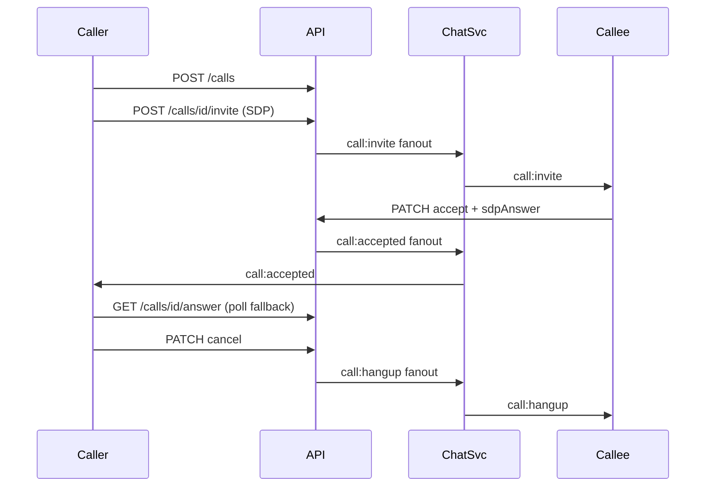

# تماس صوتی (P2P WebRTC)

## پیش‌نیاز

- Communication Gateway: `mini-services/chat-service` (پورت ۳۰۰۴) — `npm run dev:chat`
- `NEXT_PUBLIC_CHAT_SOCKET_URL=http://localhost:3004`
- `npx prisma migrate deploy` برای فیلدهای `VoiceCall` (`signalingOffer`, `signalingAnswer`)

## معماری

**سرور منبع حقیقت است** — هر تغییر وضعیت (پذیرش، رد، لغو، قطع) از `PATCH /api/calls/[id]` انجام می‌شود. سرور از Redis/HTTP به طرف مقابل fanout می‌کند. کلاینت هر ۱ ثانیه با `useVoiceCallSync` وضعیت را poll می‌کند (fallback وقتی socket رویداد نرسد).



## Janus + coturn (اختیاری — مسیر جدا)

```bash
cp .env.voice.example .env.voice
docker compose -f docker-compose.voice.yml --env-file .env.voice up -d
```

- TURNS روی پورت **443 TCP**
- `GET /api/voice/credentials` — Janus room (مسیر `useVoiceCall.ts`، جدا از P2P `call-controller`)

## Env

| متغیر | توضیح |
|--------|--------|
| `NEXT_PUBLIC_CHAT_SOCKET_URL` | Socket.io chat-service |
| `REDIS_URL` | fanout production (اختیاری local — HTTP mirror هم هست) |
| `NEXT_PUBLIC_JANUS_WS_URL` | Janus (اختیاری) |
| `NEXT_PUBLIC_VOICE_RELAY_ONLY` | `true` — فقط relay ICE |

## API

| Route | توضیح |
|-------|--------|
| `POST /api/calls` | ایجاد تماس `RINGING` |
| `POST /api/calls/[id]/invite` | ذخیره SDP offer + fanout `call:invite` |
| `GET /api/calls/incoming` | poll تماس‌های ورودی (callee) |
| `GET /api/calls/[id]/offer` | SDP offer (callee) |
| `GET /api/calls/[id]/answer` | SDP answer (caller، وقتی ACTIVE) |
| `GET /api/calls/[id]` | وضعیت تماس |
| `PATCH /api/calls/[id]` | `{ action: 'accept' \| 'reject' \| 'cancel' \| 'end', sdpAnswer? }` |

### PATCH actions

| action | چه کسی | وضعیت قبل | نتیجه |
|--------|--------|-----------|--------|
| `accept` | callee | RINGING | ACTIVE + `call:accepted` → caller |
| `reject` | callee | RINGING | REJECTED + `call:reject` → caller |
| `cancel` | caller | RINGING | ENDED + `call:hangup` → callee |
| `end` | هر دو | ACTIVE | ENDED + `call:hangup` → peer |

تماس فقط بین کاربرانی که **Conversation** مشترک دارند.

## Socket events (از chat-service)

| Event | جهت | منبع |
|-------|-----|------|
| `call:invite` | server → callee | POST invite fanout |
| `call:accepted` | server → caller | PATCH accept fanout |
| `call:reject` | server → caller | PATCH reject fanout |
| `call:hangup` | server → peer | PATCH cancel/end fanout |
| `call:ice-candidate` | peer relay | socket (WebRTC trickle) |
| `call:accept` | legacy | backward compat |

## کلاینت

- `GlobalVoiceCallLayer` — mount در `layout.tsx`
- `call-controller.ts` — state machine + WebRTC
- `useVoiceCallSync` — poll یکپارچه incoming + status
- `VoiceCallOverlay` — UI بنر/تمام‌صفحه

## تست

```bash
npx prisma migrate deploy
npx tsx scripts/test-voice-call-e2e.ts
```

## چک‌لیست QA (دو مرورگر / دو کاربر)

| سناریو | انتظار |
|--------|--------|
| تماس خروجی | زنگ → callee بنر → accept → صدا دوطرفه |
| رد تماس | callee رد → caller ≤۲s ساکت + toast |
| لغو تماس‌گیرنده | caller قطع در ringing → callee ≤۲s ساکت |
| chat-service خاموش | poll-only: reject/cancel/accept هنوز کار کند (ICE کندتر) |
| بدون گفتگو مشترک | 403 از POST /calls |
