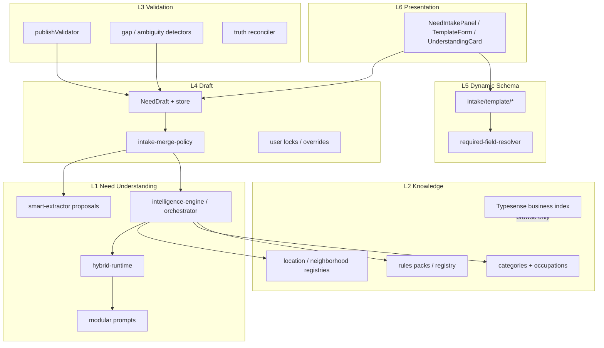

# Module diagram

**Status:** Blueprint v1

---

## 1. Mermaid — layer × modules



---

## 2. Directory map (implementation anchors)

| Layer | Primary paths |
|-------|----------------|
| L1 | `src/intake/intelligence-engine/`, `src/intake/rules/`, `src/intake/agent/`, `src/lib/need-intake/` |
| L2 | `src/config/categories*`, `src/lib/neighborhoods/`, `src/lib/search/typesense-*`, `src/intake/rules/packs/` |
| L3 | `src/intake/validation/`, gap/ambiguity modules |
| L4 | `src/contracts/need-intake`, `src/stores/need-intake-store`, merge policy |
| L5 | `src/intake/template/`, `src/intake/rendering/` |
| L6 | `src/components/need-intake/`, `src/app/(main)/**/post*` |

API surface: `src/app/api/intake/**`, `src/app/api/business/**` — **not** Nest legacy.

---

## 3. Allowed dependencies

```
L6 → L5, L4          (types/DTOs only from L1–L3)
L5 → L2, L4
L4 → L3, L1 outputs
L3 → L2, L5 schemas
L2 → (data stores)
L1 → L2
```

**Forbidden:** L6 → model HTTP clients; L1 → React; circular L4↔L6 stores calling analyze inside render without hooks boundary.

---

## 4. Test modules

| Concern | Location pattern |
|---------|------------------|
| Golden / hybrid | `src/intake/**/fixtures`, `npm run test:*-golden` |
| Merge / field answered | `src/lib/need-intake/fixtures` |
| Typesense | sync script + browse fallback tests |
| UI | component tests sparingly; prefer pipeline gates |

---

## 5. Change impact heatmap

| Change | Touch layers | Gate |
|--------|--------------|------|
| New prompt stage | L1, eval | prompt + golden |
| New template field | L5, L3, L6 | required resolver + publish |
| Typesense field | L2, ADR | sync + browse |
| Category taxonomy | L2, L1, matching | corpus + golden |
| Compose UX only | L6 (and maybe L4 apply) | no publish regression |
